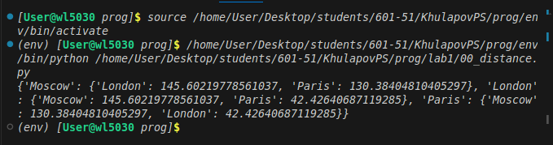
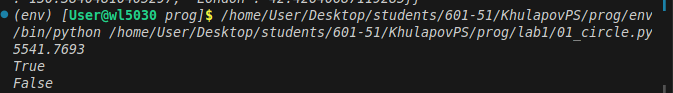
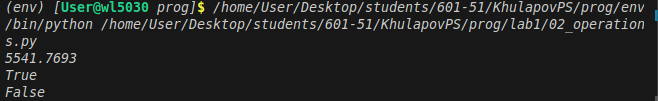
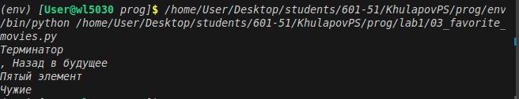
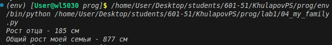
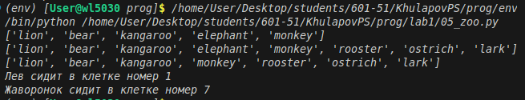
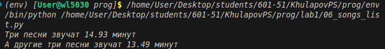
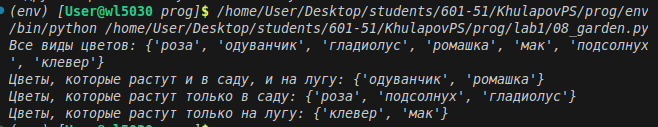
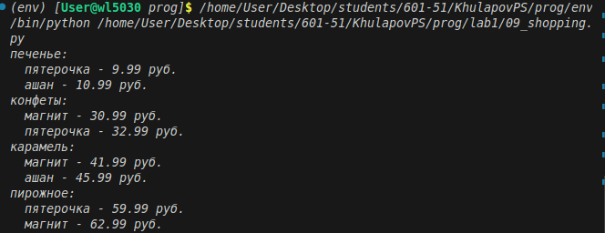
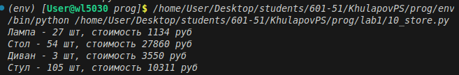

# Отчёт по лабораторной работе №1
# Тема: Основные типы и операции в Python

# Задание для самостоятельного выполнения
# Сложность: Rare

1. Архив с 11 заданиями был скачан и распакован в репозиторий.
2. По каждому заданию приведено описание и скриншот работы программы.

---

# Ход работы

Распакован архив, содержащий 11 практических заданий.
В ходе выполнения изучены базовые типы данных Python:
числа, строки, списки, словари, множества и операции над ними.

---

# Задание 0
Описание: Составить словарь расстояний между городами с использованием вложенных словарей.
Результат: На основе словаря координат сформирован словарь с расстояниями между каждой парой городов.

# Задание 1
Описание: Вычислить площадь круга с точностью до 4 знаков после запятой. Определить, находится ли точка внутри круга.
Результат: Площадь выведена с округлением, выполнена проверка принадлежности точки.

# Задание 2
Описание: Расставить знаки операций (+, -, ×) и скобки так, чтобы выражение стало верным.
Результат: Получено корректное арифметическое выражение.

# Задание 3
Описание: С помощью индексации строки вывести на консоль требуемые фрагменты текста.
Результат: Выполнена работа с индексами строк.

# Задание 4
Описание: Создать список членов семьи с указанием роста. Вывести рост отца и общий рост всех членов семьи.
Результат: Рост отца и суммарный рост выведены.

# Задание 5
Описание: В список животных добавить медведя между львом и кенгуру. Добавить птиц из списка birds в конец зоопарка.
Результат: Список изменён в соответствии с условием.

# Задание 6
Описание: Вычислить общее время звучания двух наборов песен.
Результат: Времена суммированы и выведены.

# Задание 7
Описание: Расшифровать и вывести сообщение.
Результат: Сообщение расшифровано и выведено.

# Задание 8
Описание: Создать множества цветов сада и луга. Вывести:
- все виды цветов
- цветы, растущие и там, и там
- цветы, растущие только в саду
- цветы, растущие только на лугу
Результат: Операции над множествами выполнены.

# Задание 9
Описание: Создать словарь цен на продукты. Указать два магазина с минимальными ценами.
Результат: Словарь создан, минимальные цены найдены.

# Задание 10
Описание: Рассчитать стоимость каждого вида товара на складе. Вывести:
- стоимость каждого вида товара
- общее количество столов и их общую стоимость
- общее количество стульев и их общую стоимость
Результат: Расчёты выполнены, данные выведены.
