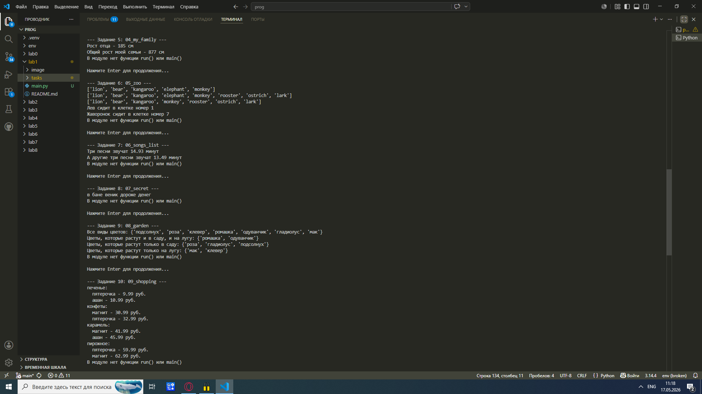
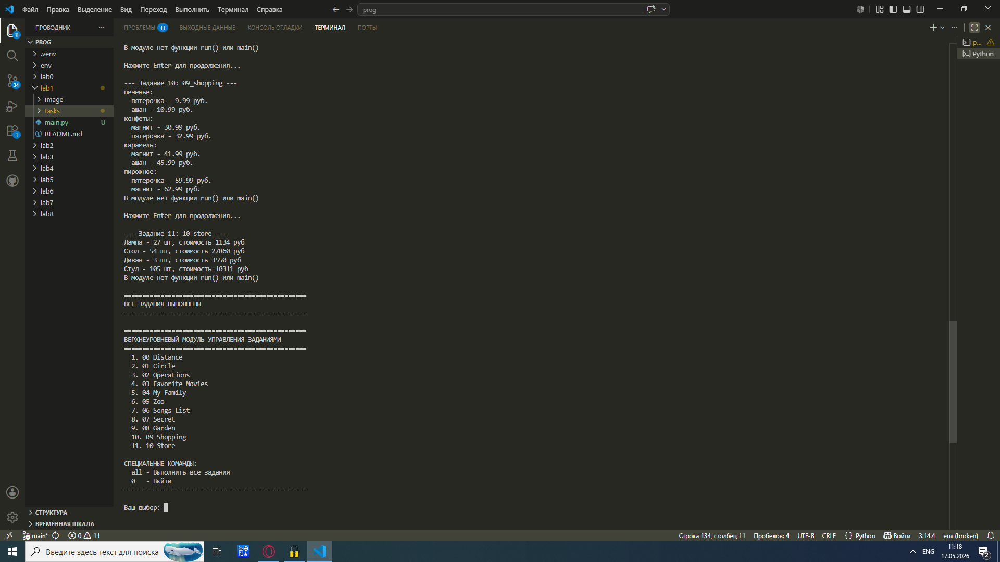

# Отчёт по лабораторной работе №1
# Тема: Основные типы и операции в Python

# Задание для самостоятельного выполнения
# Сложность: Rare

1. Архив с 11 заданиями был скачан и распакован в репозиторий.
2. По каждому заданию приведено описание и скриншот работы программы.

---

# Ход работы

Распакован архив, содержащий 11 практических заданий.
В ходе выполнения изучены базовые типы данных Python:
числа, строки, списки, словари, множества и операции над ними.

---

# Задание 0
Описание: Составить словарь расстояний между городами с использованием вложенных словарей.
Результат: На основе словаря координат сформирован словарь с расстояниями между каждой парой городов.


# Задание 1
Описание: Вычислить площадь круга с точностью до 4 знаков после запятой. Определить, находится ли точка внутри круга.
Результат: Площадь выведена с округлением, выполнена проверка принадлежности точки.


# Задание 2
Описание: Расставить знаки операций (+, -, ×) и скобки так, чтобы выражение стало верным.
Результат: Получено корректное арифметическое выражение.


# Задание 3
Описание: С помощью индексации строки вывести на консоль требуемые фрагменты текста.
Результат: Выполнена работа с индексами строк.


# Задание 4
Описание: Создать список членов семьи с указанием роста. Вывести рост отца и общий рост всех членов семьи.
Результат: Рост отца и суммарный рост выведены.


# Задание 5
Описание: В список животных добавить медведя между львом и кенгуру. Добавить птиц из списка birds в конец зоопарка.
Результат: Список изменён в соответствии с условием.


# Задание 6
Описание: Вычислить общее время звучания двух наборов песен.
Результат: Времена суммированы и выведены.


# Задание 7
Описание: Расшифровать и вывести сообщение.
Результат: Сообщение расшифровано и выведено.


# Задание 8
Описание: Создать множества цветов сада и луга. Вывести:
- все виды цветов
- цветы, растущие и там, и там
- цветы, растущие только в саду
- цветы, растущие только на лугу
Результат: Операции над множествами выполнены.


# Задание 9
Описание: Создать словарь цен на продукты. Указать два магазина с минимальными ценами.
Результат: Словарь создан, минимальные цены найдены.

# Задание 10
Описание: Рассчитать стоимость каждого вида товара на складе. Вывести:
- стоимость каждого вида товара
- общее количество столов и их общую стоимость
- общее количество стульев и их общую стоимость
Результат: Расчёты выполнены, данные выведены.


# Реализация верхнеуровневого модуля (Medium)

## Описание задачи

Необходимо разработать верхнеуровневый модуль main.py, который объединяет 11 отдельных заданий (уровень Rare) в единую систему. Модуль должен обеспечивать инкапсуляцию логики каждого задания, корректное импортирование модулей и удобный интерфейс для выполнения заданий.

## Решение

### Структура проекта

lab1/
├── main.py          # Верхнеуровневый модуль
├── tasks/           # Папка с заданиями
│   ├── 00_distance.py
│   ├── 01_circle.py
│   ├── 02_operations.py
│   ├── 03_favorite_movies.py
│   ├── 04_my_family.py
│   ├── 05_zoo.py
│   ├── 06_songs_list.py
│   ├── 07_secret.py
│   ├── 08_garden.py
│   ├── 09_shopping.py
│   └── 10_store.py
└── image/           # Скриншоты

### Инкапсуляция заданий

В каждый файл задания добавлена функция run(). Пример для файла 00_distance.py:
```python

def calculate_distances():
    sites = {
        "Moscow": (550, 370),
        "London": (510, 510),
        "Paris": (480, 480),
    }
    
    distances = {}
    for city1 in sites:
        distances[city1] = {}
        for city2 in sites:
            if city1 != city2:
                x1, y1 = sites[city1]
                x2, y2 = sites[city2]
                distance = ((x1 - x2)**2 + (y1 - y2)**2) ** 0.5
                distances[city1][city2] = distance
    
    print(distances)

def run():
    calculate_distances()

if __name__ == "__main__":
    run()
```
### Верхнеуровневый модуль (main.py)
```python

import sys
import os
import importlib

sys.path.insert(0, os.path.join(os.path.dirname(__file__), 'tasks'))

TASK_MODULES = [
    '00_distance', '01_circle', '02_operations',
    '03_favorite_movies', '04_my_family', '05_zoo',
    '06_songs_list', '07_secret', '08_garden',
    '09_shopping', '10_store'
]

def load_task(module_name):
    try:
        return importlib.import_module(module_name)
    except ImportError as e:
        print(f"Ошибка импорта {module_name}: {e}")
        return None

def show_menu():
    print("\n" + "="*50)
    print("ВЕРХНЕУРОВНЕВЫЙ МОДУЛЬ УПРАВЛЕНИЯ ЗАДАНИЯМИ")
    print("="*50)
    
    for i, name in enumerate(TASK_MODULES, 1):
        task_name = name.replace('_', ' ').title()
        print(f"  {i}. {task_name}")
    
    print("\n  all - Выполнить все задания")
    print("  0   - Выход")
    print("="*50)

def run_single_task(task_num):
    if 1 <= task_num <= len(TASK_MODULES):
        module_name = TASK_MODULES[task_num-1]
        print(f"\n--- Задание {task_num}: {module_name} ---")
        
        module = load_task(module_name)
        if module and hasattr(module, 'run'):
            module.run()
        else:
            print("Ошибка: функция run() не найдена")
    else:
        print("Неверный номер задания")

def run_all_tasks():
    print("\n" + "="*50)
    print("ЗАПУСК ВСЕХ ЗАДАНИЙ")
    print("="*50)
    
    for i, name in enumerate(TASK_MODULES, 1):
        print(f"\n--- Задание {i}: {name} ---")
        module = load_task(name)
        if module and hasattr(module, 'run'):
            module.run()
        else:
            print(f"Ошибка в задании {i}")
        
        if i < len(TASK_MODULES):
            input("\nНажмите Enter для продолжения...")

def main():
    print(f"Загружено заданий: {len(TASK_MODULES)}")
    
    while True:
        show_menu()
        choice = input("\nВаш выбор: ").strip().lower()
        
        if choice == '0':
            print("До свидания!")
            break
        elif choice == 'all':
            run_all_tasks()
        elif choice.isdigit():
            run_single_task(int(choice))
        else:
            print("Неверный ввод")

if __name__ == "__main__":
    main()
```

### Возможности модуля

Команда 1-11 - Выполнить конкретное задание
Команда all - Выполнить все 11 заданий последовательно
Команда 0 - Выход из программы

## Результат работы







## Ключевые аспекты реализации

Инкапсуляция: каждое задание независимо и имеет функцию run(), задания не зависят друг от друга, внутренняя реализация скрыта от верхнеуровневого модуля.

Динамический импорт: используется importlib.import_module() для загрузки модулей по имени.

Унифицированный интерфейс: все задания вызываются одинаково через run(), что позволяет легко добавлять новые задания без изменения основного кода.

## Вывод

Верхнеуровневый модуль успешно реализован. Он обеспечивает корректное импортирование всех 11 заданий, инкапсуляцию логики каждого задания, удобный интерфейс командной строки, возможность массового выполнения и масштабируемость для добавления новых заданий.