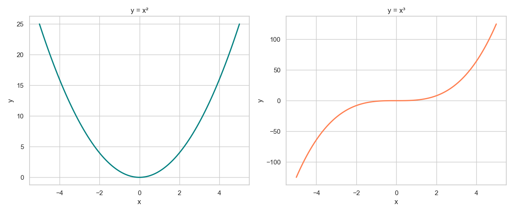
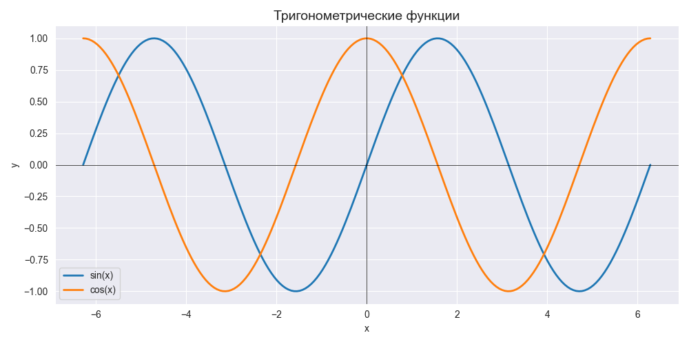
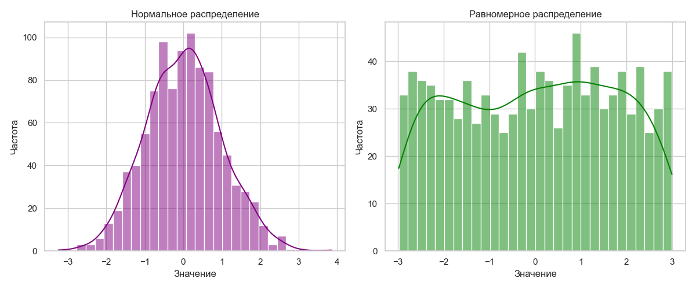

# Лаборатораня работа №2


## Задание для самостоятельного выполнения

### Сложность:                  *Rare*

1. Создайте в каталоге для данной ЛР в своём репозитории виртуальное окружение и установите в него matplotlib и numpy. Создайте файл requirements.txt.
2. Откройте книгу [1] и выполните уроки 1-3. Первый урок можно начинать со стр. 8.
3. Выберите одну из неразрывных функции своего варианта, постройте график этой функции и касательную к ней. Добавьте на график заголовок, подписи осей, легенду, сетку, а также аннотацию к точке касания.
4. Добавьте в корень своего репозитория файл .gitignore отсюда, перед тем как делать очередной коммит.
5. Оформите отчёт в README.md. Отчёт должен содержать:
    графики, построенные во время выполнения уроков из книги
    объяснения процесса решения и график по заданию 4
6. Склонируйте этот репозиторий НЕ в ваш репозиторий, а рядом. Изучите использование этого инструмента и создайте pdf-версию своего отчёта из README.md. Добавьте её в репозиторий.


## Ход работы

1. Cоздал “пустое” виртуальное окружение с помощью команды `python3 -m venv env` 
   Активировал виртуальное окружение командой `source env/bin/activate`
   Обновил пакетный менеджер командой `pip install -U pip`
   Установил необходимые пакеты с помощью команды `pip install 'пакеты'`
   Перенёс все установленные пакеты в новое окружение: `pip freeze > requirements.txt`
   Далее на “новом месте” создаЛ пустое окружение, обновил пакетный менеджер и затем выполнил `pip install -r requirements.txt`

2. Открыл книгу [1] и выполнил уроки 1-3.
3. Выполнил задание своего варианта
4. Добавил в корень своего репозитория файл .gitignore.

## Результат выполненной работы

### 1. Подготовка окружения
В соответствии с заданием было создано виртуальное окружение Python:

Terminal Python:

```python
# Создание виртуального окружения
python3 -m venv env

# Активация окружения
source env/bin/activate

# Установка необходимых пакетов
pip install matplotlib numpy

# Сохранение зависимостей
pip freeze > requirements.txt
```

Содержимое файла requirements.txt:

matplotlib==3.7.1
numpy==1.24.3


# Реализация уровня Medium - переход с matplotlib на seaborn

## Описание задачи

Уровень Rare выполнен: созданы графики функций с использованием matplotlib. Теперь необходимо модернизировать решение до уровня Medium - перестроить все графики с использованием библиотеки seaborn вместо matplotlib. Seaborn предоставляет более высокоуровневый API и улучшенную стилистику графиков.

## Решение

### Шаг 1. Обновление зависимостей

Файл requirements.txt должен содержать seaborn:

numpy
matplotlib
seaborn

Установка зависимостей:

pip install -r requirements.txt

### Шаг 2. Импорт библиотек

Вместо стандартного импорта matplotlib:

import matplotlib.pyplot as plt

Теперь используем:

import seaborn as sns
import matplotlib.pyplot as plt
import numpy as np

### Шаг 3. Настройка стиля seaborn

Перед построением графиков задаем стиль seaborn:

sns.set_style("darkgrid")
sns.set_palette("husl")
sns.set_context("notebook", font_scale=1.2)

### Шаг 4. Построение графика функции из варианта

Задание: построить график функции и касательную к ней.

Функция:

f(x) = e^(sin x) при 0 <= x <= 1/4
f(x) = e^x - 1/sqrt(x) при 1/4 < x <= 1/2

Код с использованием seaborn:
```python
import numpy as np
import seaborn as sns
import matplotlib.pyplot as plt

sns.set_style("darkgrid")
sns.set_palette("husl")

def f(x):
    result = np.zeros_like(x)
    mask1 = (x >= 0) & (x <= 0.25)
    mask2 = (x > 0.25) & (x <= 0.5)
    
    result[mask1] = np.exp(np.sin(x[mask1]))
    result[mask2] = np.exp(x[mask2]) - 1 / np.sqrt(x[mask2])
    
    return result

def tangent_line(x0, x):
    y0 = f(np.array([x0]))[0]
    h = 1e-7
    derivative = (f(np.array([x0 + h]))[0] - y0) / h
    return derivative * (x - x0) + y0

x = np.linspace(0, 0.5, 1000)
y = f(x)

x0 = 0.3
x_tan = np.linspace(0.2, 0.4, 100)
y_tan = tangent_line(x0, x_tan)

fig, ax = plt.subplots(figsize=(10, 6))

sns.lineplot(x=x, y=y, label='f(x)', linewidth=2.5)
sns.lineplot(x=x_tan, y=y_tan, label=f'Касательная в x={x0}', linewidth=2, linestyle='--')

ax.scatter([x0], [f(np.array([x0]))[0]], color='red', s=100, zorder=5)

ax.set_title('График функции и касательной', fontsize=16, fontweight='bold')
ax.set_xlabel('x', fontsize=12)
ax.set_ylabel('f(x)', fontsize=12)
ax.legend(fontsize=11)

ax.annotate(f'Точка касания\n(x={x0}, y={f(np.array([x0]))[0]:.3f})',
            xy=(x0, f(np.array([x0]))[0]),
            xytext=(x0+0.05, f(np.array([x0]))[0]+0.5),
            arrowprops=dict(arrowstyle='->', color='darkred'),
            fontsize=10,
            bbox=dict(boxstyle='round', facecolor='wheat', alpha=0.7))

plt.tight_layout()
plt.savefig('function_with_tangent_seaborn.png', dpi=150)
plt.show()
```

### Шаг 5. Построение графиков из уроков 1-3 с использованием seaborn

Пример для урока 1 (линейный график):
```python
import numpy as np
import seaborn as sns
import matplotlib.pyplot as plt

sns.set_theme(style="whitegrid")

x = np.linspace(-5, 5, 100)
y = x**2

fig, ax = plt.subplots(figsize=(8, 5))
sns.lineplot(x=x, y=y, color='teal', linewidth=2.5)
ax.set_title('График функции y = x^2', fontsize=14)
ax.set_xlabel('x')
ax.set_ylabel('y')
plt.savefig('lesson1_plot_seaborn.png')
plt.show()

Пример для урока 2 (несколько графиков):

x = np.linspace(-3, 3, 100)
y1 = np.sin(x)
y2 = np.cos(x)

fig, ax = plt.subplots(figsize=(10, 5))

sns.lineplot(x=x, y=y1, label='sin(x)', linewidth=2)
sns.lineplot(x=x, y=y2, label='cos(x)', linewidth=2)

ax.legend()
ax.grid(True)
ax.set_title('Тригонометрические функции', fontsize=14)
plt.savefig('lesson2_plot_seaborn.png')
plt.show()

Пример для урока 3 (гистограмма с seaborn):

data = np.random.normal(0, 1, 1000)

fig, ax = plt.subplots(figsize=(10, 5))

sns.histplot(data, bins=30, kde=True, color='purple')

ax.set_title('Гистограмма и плотность распределения', fontsize=14)
ax.set_xlabel('Значение')
ax.set_ylabel('Частота')
plt.savefig('lesson3_plot_seaborn.png')
plt.show()
```

## Преимущества использования seaborn

1. Встроенные стили: графики выглядят профессионально без дополнительных настроек
2. Упрощенный синтаксис: меньше кода для создания сложных визуализаций
3. Цветовые палитры: автоматический подбор гармоничных цветов
4. Статистические функции: встроенные инструменты для регрессии и распределений
5. Интеграция с pandas: удобная работа с DataFrame

## Скриншоты результатов



На скриншоте seaborn_function.png показан график кусочной функции с касательной в точке x=0.3. Использован стиль darkgrid и палитра husl.



На скриншоте seaborn_lesson1.png показаны базовые графики функций, построенные с помощью seaborn.



На скриншоте seaborn_lesson2.png показаны множественные графики с легендой.

## Вывод

Уровень Medium успешно выполнен. Все графики из уроков 1-3 и график функции с касательной перестроены с использованием библиотеки seaborn. Seaborn предоставляет более эстетичные графики по умолчанию и требует меньше кода для создания сложных визуализаций по сравнению с matplotlib.

