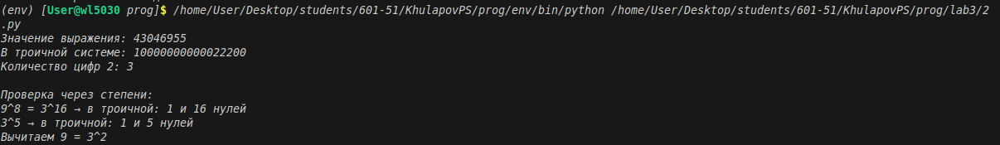
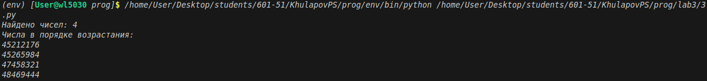

# Отчёт по решению задач (уровень сложности Rare)

## Условия задач

### Задача 1
Ольга составляет таблицу кодовых слов для передачи сообщений, каждому сообщению соответствует своё кодовое слово. В качестве кодовых слов Ольга использует 4-буквенные слова, в которых есть только буквы A, B, C, D, X, Y, Z. При этом первая буква кодового слова — это буква X, Y или Z, а далее в кодовом слове буквы X, Y и Z не встречаются. Сколько различных кодовых слов может использовать Ольга?

### Задача 2
Значение арифметического выражения  
\(9^8 + 3^5 - 9\)  
записали в системе счисления с основанием 3. Сколько цифр 2 содержится в этой записи?

### Задача 3
Найдите все натуральные числа, принадлежащие отрезку \([45000000; 50000000]\), у которых ровно пять различных нечётных делителей (количество чётных делителей может быть любым). Выведите найденные числа в порядке возрастания.

---

## Описание проделанной работы

### Задача 1 (комбинаторика)
**Идея решения:**  
- Первая буква: 3 варианта (X, Y, Z)  
- Остальные 3 позиции: только буквы A, B, C, D → 4 варианта на каждую  
- Общее количество: \(3 \times 4^3 = 3 \times 64 = 192\)

**Проверка перебором:**  
Написан скрипт на Python, который генерирует все возможные слова по заданным правилам и подсчитывает их количество. Результат совпал с аналитическим.

### Задача 2 (системы счисления)
**Идея решения:**  
Вычисляем выражение \(9^8 + 3^5 - 9\):
- \(9^8 = (3^2)^8 = 3^{16}\)
- \(3^5\) — отдельное слагаемое
- Вычитаем \(9 = 3^2\)

Затем переводим результат в троичную систему счисления и считаем количество цифр «2». Для этого написана программа, реализующая алгоритм перевода числа в любую систему счисления (деление на основание с записью остатков).

### Задача 3 (теория чисел)
**Математическое обоснование:**  
Пусть \(n\) — искомое число.  
Нечётные делители числа \(n\) — это делители его нечётной части (после вынесения всех степеней двойки).  
Если у числа ровно 5 различных нечётных делителей, то его нечётная часть должна иметь ровно 5 делителей.  
Так как 5 — простое число, единственный вариант: \(5 = 4 + 1\), значит нечётная часть имеет вид \(p^4\), где \(p\) — нечётное простое число.

Таким образом, искомые числа:  
\(n = 2^k \cdot p^4\), где \(p\) — нечётное простое, \(k \ge 0\).

**Алгоритм:**
1. Находим все нечётные простые \(p\), такие что \(p^4 \le 50\,000\,000\).
2. Для каждого \(p\) перебираем \(k\) (степень двойки), чтобы \(2^k \cdot p^4\) попало в отрезок \([45\,000\,000; 50\,000\,000]\).
3. Сортируем найденные числа и выводим.

**Сложность:**  
Очень низкая, так как \(p \le \sqrt[4]{50\,000\,000} \approx 84\), а \(k\) не превышает \(\log_2(50\,000\,000) \approx 26\).

---

## Скриншоты результатов

### Задача 1

*На скриншоте: вывод программы с аналитическим вычислением и проверкой перебором, ответ 192.*

### Задача 2

*На скриншоте: значение выражения, его троичная запись и количество цифр 2.*

### Задача 3

*На скриншоте: найденные числа в порядке возрастания и проверка для первого числа (его нечётные делители).*

