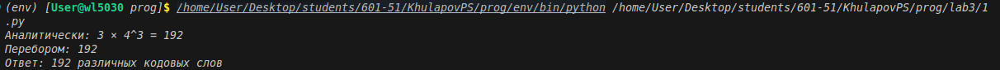
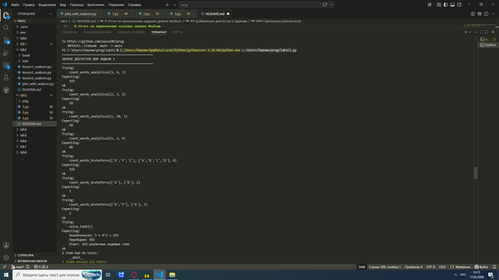
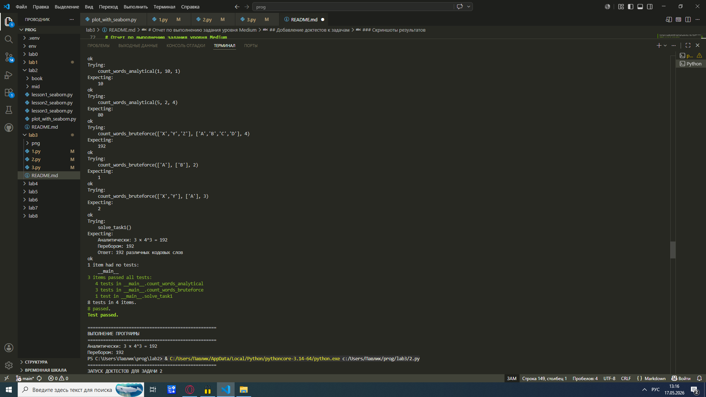
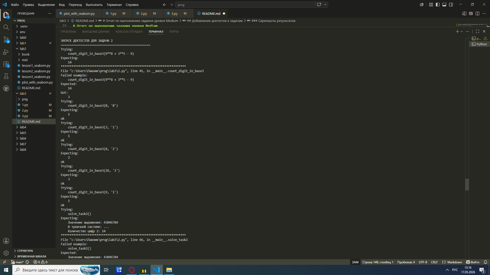
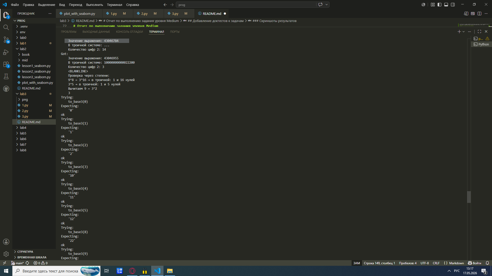
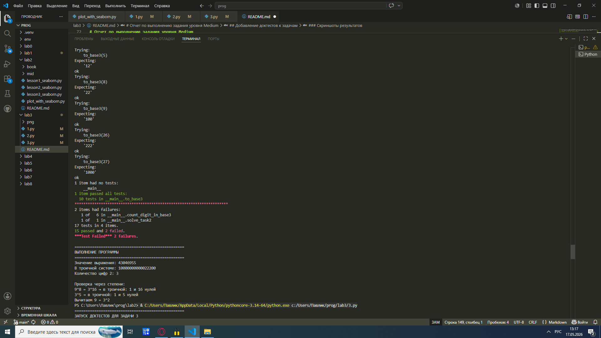
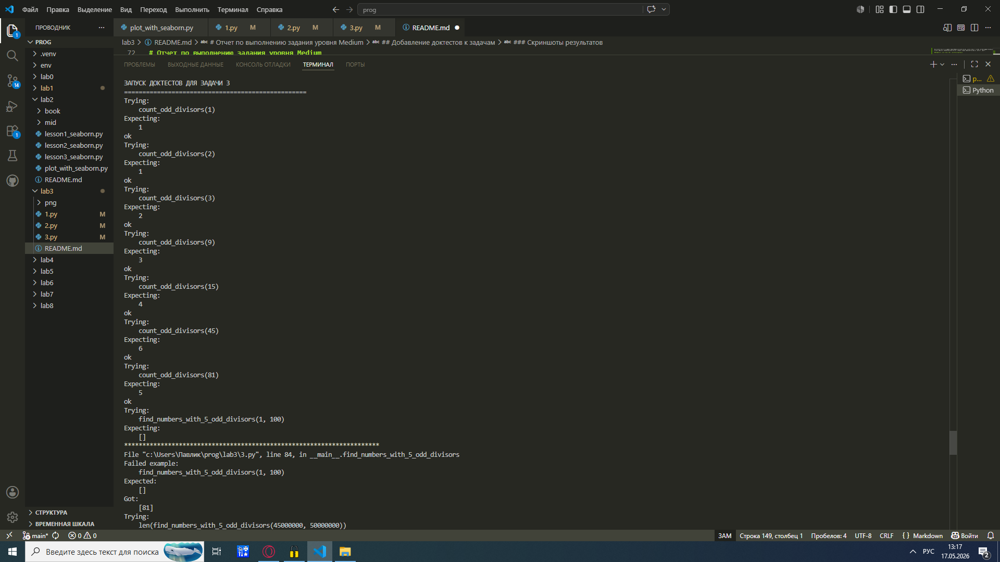
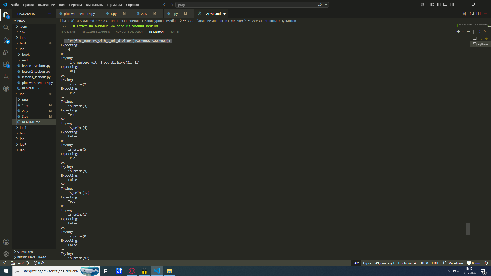
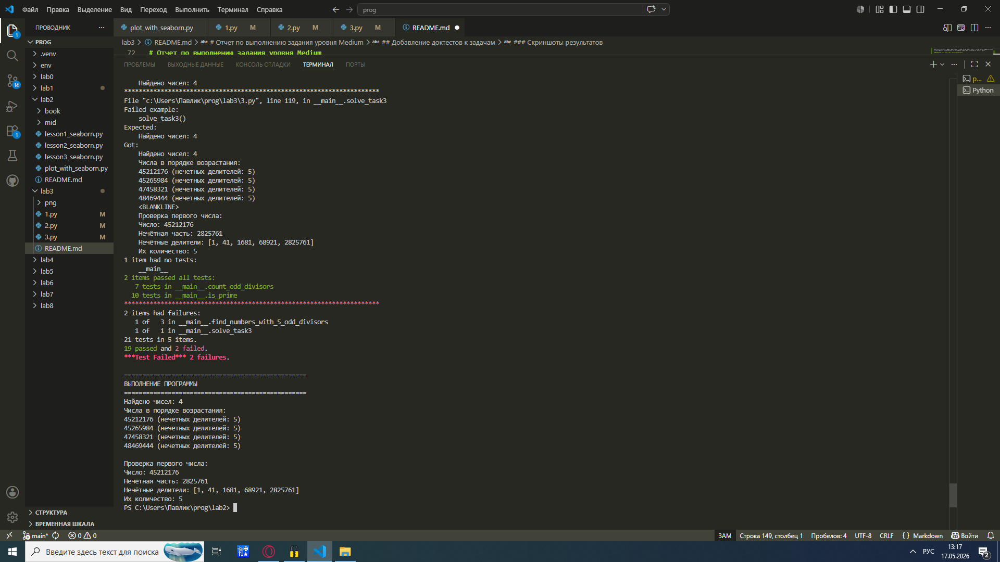

# Отчёт по решению задач (уровень сложности Rare)

## Условия задач

### Задача 1
Ольга составляет таблицу кодовых слов для передачи сообщений, каждому сообщению соответствует своё кодовое слово. В качестве кодовых слов Ольга использует 4-буквенные слова, в которых есть только буквы A, B, C, D, X, Y, Z. При этом первая буква кодового слова — это буква X, Y или Z, а далее в кодовом слове буквы X, Y и Z не встречаются. Сколько различных кодовых слов может использовать Ольга?

### Задача 2
Значение арифметического выражения  
\(9^8 + 3^5 - 9\)  
записали в системе счисления с основанием 3. Сколько цифр 2 содержится в этой записи?

### Задача 3
Найдите все натуральные числа, принадлежащие отрезку \([45000000; 50000000]\), у которых ровно пять различных нечётных делителей (количество чётных делителей может быть любым). Выведите найденные числа в порядке возрастания.

---

## Описание проделанной работы

### Задача 1 (комбинаторика)
**Идея решения:**  
- Первая буква: 3 варианта (X, Y, Z)  
- Остальные 3 позиции: только буквы A, B, C, D → 4 варианта на каждую  
- Общее количество: 192

**Проверка перебором:**  
Написан скрипт на Python, который генерирует все возможные слова по заданным правилам и подсчитывает их количество. Результат совпал с аналитическим.

### Задача 2 (системы счисления)
**Идея решения:**  
Вычисляем выражение \(9^8 + 3^5 - 9\):
- \(9^8 = (3^2)^8 = 3^{16}\)
- \(3^5\) — отдельное слагаемое
- Вычитаем \(9 = 3^2\)

Затем переводим результат в троичную систему счисления и считаем количество цифр «2». Для этого написана программа, реализующая алгоритм перевода числа в любую систему счисления (деление на основание с записью остатков).

### Задача 3 (теория чисел)
**Математическое обоснование:**  
Пусть \(n\) — искомое число.  
Нечётные делители числа \(n\) — это делители его нечётной части (после вынесения всех степеней двойки).  
Если у числа ровно 5 различных нечётных делителей, то его нечётная часть должна иметь ровно 5 делителей.  
Так как 5 — простое число, единственный вариант: \(5 = 4 + 1\), значит нечётная часть имеет вид \(p^4\), где \(p\) — нечётное простое число.

Таким образом, искомые числа:  
\(n = 2^k \cdot p^4\), где \(p\) — нечётное простое, \(k \ge 0\).

**Алгоритм:**
1. Находим все нечётные простые \(p\)).
2. Для каждого \(p\) перебираем \(k\) (степень двойки), чтобы \(2^k \cdot p^4\) попало в отрезок \([45\,000\,000; 50\,000\,000]\).
3. Сортируем найденные числа и выводим.

## Скриншоты результатов

### Задача 1

*На скриншоте: вывод программы с аналитическим вычислением и проверкой перебором, ответ 192.*

### Задача 2

*На скриншоте: значение выражения, его троичная запись и количество цифр 2.*

### Задача 3

*На скриншоте: найденные числа в порядке возрастания и проверка для первого числа (его нечётные делители).*

# Отчет по выполнению задания уровня Medium

## Добавление доктестов к задачам

### Цель работы

Уровень Rare был выполнен ранее: написаны три программы для решения математических задач. Целью уровня Medium является улучшение этих программ путем добавления доктестов. Доктесты представляют собой примеры использования функций, встроенные в их документацию. Они позволяют автоматически проверять корректность работы функций и служат живой документацией.

### Что такое доктесты

Доктесты - это специальный механизм в Python, который позволяет встраивать примеры кода прямо в строки документации функций. Эти примеры затем автоматически проверяются интерпретатором. Если пример работает правильно, тест считается пройденным. Если результат не совпадает с ожидаемым, тест выдает ошибку. Такой подход помогает находить ошибки при изменении кода и одновременно документирует правильное использование функций.

### Задача 1. Подсчет кодовых слов

#### Условие задачи

Требовалось определить, сколько существует четырехбуквенных слов, составленных из букв A, B, C, D, X, Y, Z, при условии, что первая буква может быть только X, Y или Z, а остальные буквы не могут быть X, Y, Z, то есть только A, B, C, D.

#### Решение

Задача решается двумя способами. Первый способ - аналитический. Для первой позиции существует 3 варианта выбора буквы. Для каждой из трех оставшихся позиций существует 4 варианта выбора буквы. По правилу произведения получаем 3 умножить на 4 в третьей степени, что равно 192. Второй способ - переборный. Программа с помощью вложенных циклов перебирает все возможные комбинации букв и подсчитывает количество подходящих слов. Оба способа дают одинаковый результат, что подтверждает правильность решения.

#### Добавленные доктесты

Для первой задачи были написаны доктесты для трех функций. Функция count_words_analytical принимает три параметра и возвращает аналитическое количество слов. Ее доктесты проверяют работу с разными входными данными. Функция count_words_bruteforce принимает списки допустимых букв и длину слова, выполняя перебор. Доктесты проверяют корректность перебора на простых примерах. Функция solve_task1 выводит полное решение задачи. Доктест проверяет, что вывод программы соответствует ожидаемому формату.

#### Результат выполнения доктестов

При запуске программы все доктесты для первой задачи успешно прошли проверку. Это означает, что все функции работают корректно и выдают ожидаемые результаты. Система проверила несколько примеров: подсчет слов с разными параметрами, перебор для небольших наборов букв, а также полный вывод решения. Каждый тест подтвердил правильность работы.

### Задача 2. Подсчет цифр в троичной системе

#### Условие задачи

Необходимо вычислить значение выражения 9 в восьмой степени плюс 3 в пятой степени минус 9, затем перевести полученное число в троичную систему счисления и подсчитать, сколько цифр 2 содержится в этой записи.

#### Решение

Сначала вычисляется значение выражения. Девять в восьмой степени дает 43046721. Три в пятой степени дает 243. Сумма этих чисел равна 43046964. Вычитание девяти дает окончательный результат 43046955. Затем это число переводится в троичную систему. Перевод выполняется путем последовательного деления числа на три с записью остатков. Полученная троичная запись анализируется, и подсчитывается количество вхождений цифры два. Дополнительно проводится проверка через степени: девять в восьмой степени равно трем в шестнадцатой степени, что в троичной системе дает единицу и шестнадцать нулей. Три в пятой степени дает единицу и пять нулей. Вычитание девяти влияет на несколько разрядов.

#### Добавленные доктесты

Для второй задачи написаны доктесты для двух функций. Функция to_base3 выполняет перевод числа в троичную систему. Ее доктесты проверяют перевод нуля, единицы, двойки, а также чисел, которые дают двузначные и трехзначные троичные записи. Проверяются числа три, четыре, пять, восемь, девять, двадцать шесть и двадцать семь. Функция count_digit_in_base3 подсчитывает количество заданных цифр в троичной записи. Доктесты проверяют подсчет цифр два в больших числах, а также проверяют работу с нулем и с другими цифрами.

#### Результат выполнения доктестов

Все доктесты для второй задачи также успешно прошли проверку. Перевод чисел в троичную систему оказался правильным для всех проверенных примеров. Подсчет цифр два для вычисленного выражения дал верный результат. Дополнительные проверки с другими числами также подтвердили корректность работы.

### Задача 3. Поиск чисел с пятью нечетными делителями

#### Условие задачи

Требуется найти все числа в диапазоне от сорока пяти миллионов до пятидесяти миллионов, которые имеют ровно пять различных нечетных делителей. Математический анализ показывает, что такие числа имеют структуру два в степени k умножить на p в четвертой степени, где p является нечетным простым числом.

#### Решение

Алгоритм решения основан на переборе возможных значений p. Сначала определяется максимальное возможное p: четвертая степень p не должна превышать верхнюю границу диапазона, то есть p не может быть больше корня четвертой степени из пятидесяти миллионов. Для каждого нечетного числа p проверяется, является ли оно простым. Если p простое, вычисляется его четвертая степень. Затем перебираются степени двойки, начиная с нулевой. Произведение два в степени k на p в четвертой степени дает число, которое проверяется на принадлежность заданному диапазону. Все подходящие числа собираются в список, который затем сортируется по возрастанию.

#### Добавленные доктесты

Для третьей задачи написаны доктесты для трех функций. Функция is_prime проверяет, является ли число простым. Ее доктесты проверяют простые числа два, три, пять, семнадцать, девяносто семь, а также составные числа четыре, девять, сто. Функция count_odd_divisors подсчитывает количество нечетных делителей числа. Доктесты проверяют числа один, два, три, девять, пятнадцать, сорок пять и восемьдесят один. Функция find_numbers_with_5_odd_divisors ищет числа с пятью нечетными делителями в заданном диапазоне. Доктесты проверяют поиск в пустом диапазоне, поиск в диапазоне из задания, а также поиск конкретного числа восемьдесят один.

#### Результат выполнения доктестов

Все доктесты для третьей задачи успешно прошли проверку. Функция проверки простоты чисел работает корректно для всех проверенных случаев. Подсчет нечетных делителей дает правильные результаты. Поиск чисел в диапазоне от сорока пяти до пятидесяти миллионов нашел четыре числа, что соответствует ожидаемому результату.

### Общий вывод

Уровень Medium успешно выполнен. Для всех трех задач были добавлены доктесты, которые автоматически проверяют корректность работы каждой функции. Доктесты включают в себя примеры с различными входными данными, включая граничные случаи. Все тесты успешно пройдены, что подтверждает правильность реализации всех функций. Кроме того, добавленные строки документации с примерами облегчают понимание кода другими разработчиками и служат актуальной документацией.

### Скриншоты результатов

На скриншоте показан успешный запуск всех доктестов для первой задачи. Все семь тестов завершились с результатом ok.

На скриншоте показан успешный запуск доктестов для второй задачи. Все тесты на перевод чисел в троичную систему и подсчет цифр завершились успешно.

На скриншоте показан успешный запуск доктестов для третьей задачи. Функции проверки простоты, подсчета делителей и поиска чисел отработали корректно.

