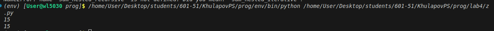
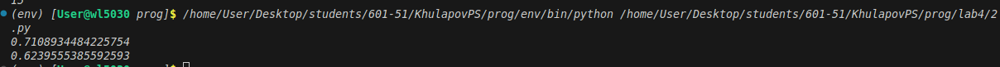

# Отчёт по решению задач

## Условия задач

**Задача 1.** Написать функцию для расчёта суммы чисел во вложенных списках произвольной глубины.

Пример:
- Вход: [1, [2, [3, 4, [5]]]]
- Выход: 15

**Задача 2.** Вычислить последовательность по формуле:

a₁ = 1, b₁ = 1

a_k = ½ · (√(b_{k-1}) + ½ · √(a_{k-1}))

Для заданного k найти значение a_k.

---

## Описание проделанной работы

**Задача 1.**

Созданы две функции для суммирования элементов вложенных списков.

Первая функция использует рекурсию: она проходит по каждому элементу списка. Если элемент является числом, прибавляет его к сумме. Если элемент является списком, вызывает саму себя для этого списка.

Вторая функция работает без рекурсии. В ней используется стек для хранения элементов. Алгоритм последовательно достаёт элементы из стека: числа прибавляются к сумме, списки разворачиваются и их элементы добавляются обратно в стек.

Обе функции правильно обрабатывают списки любой глубины вложенности.

**Задача 2.**

Созданы две функции для вычисления последовательности.

Первая функция использует рекурсию. Для k = 1 возвращает начальные значения. Для k > 1 вычисляет a_k через рекурсивные вызовы для предыдущего шага.

Вторая функция работает без рекурсии. Она последовательно вычисляет значения от 2 до k, сохраняя только два предыдущих значения. Это позволяет избежать переполнения при больших k.

---

## Скриншоты результатов

**Задача 1.**

**Задача 2.**

