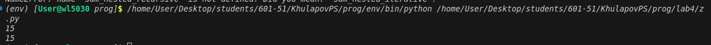
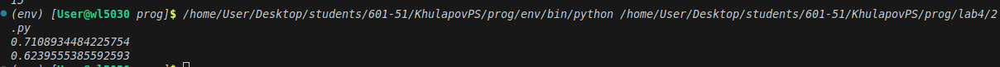
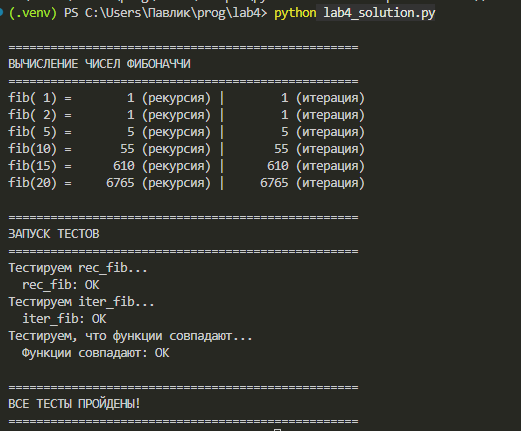

# Отчёт по решению задач

## Условия задач

**Задача 1.** Написать функцию для расчёта суммы чисел во вложенных списках произвольной глубины.

Пример:
- Вход: [1, [2, [3, 4, [5]]]]
- Выход: 15

**Задача 2.** Вычислить последовательность по формуле:

a₁ = 1, b₁ = 1

a_k = ½ · (√(b_{k-1}) + ½ · √(a_{k-1}))

Для заданного k найти значение a_k.

---

## Описание проделанной работы

**Задача 1.**

Созданы две функции для суммирования элементов вложенных списков.

Первая функция использует рекурсию: она проходит по каждому элементу списка. Если элемент является числом, прибавляет его к сумме. Если элемент является списком, вызывает саму себя для этого списка.

Вторая функция работает без рекурсии. В ней используется стек для хранения элементов. Алгоритм последовательно достаёт элементы из стека: числа прибавляются к сумме, списки разворачиваются и их элементы добавляются обратно в стек.

Обе функции правильно обрабатывают списки любой глубины вложенности.

**Задача 2.**

Созданы две функции для вычисления последовательности.

Первая функция использует рекурсию. Для k = 1 возвращает начальные значения. Для k > 1 вычисляет a_k через рекурсивные вызовы для предыдущего шага.

Вторая функция работает без рекурсии. Она последовательно вычисляет значения от 2 до k, сохраняя только два предыдущих значения. Это позволяет избежать переполнения при больших k.

---

## Скриншоты результатов

**Задача 1.**



**Задача 2.**



# Отчет по выполнению лабораторной работы №4 (уровень Medium)

## Добавление pytest тестов к рекурсивным функциям

### Условие задачи (вариант)

Дана рекуррентная последовательность:
- a₁ = 1
- a₂ = 1
- aₙ = aₙ₋₁ + aₙ₋₂ для n ≥ 3

Требуется:
1. Реализовать рекурсивную функцию для вычисления n-го члена последовательности
2. Реализовать итеративную функцию для вычисления n-го члена последовательности
3. Написать тесты с использованием pytest для проверки обеих функций

### Описание проделанной работы

#### 1. Реализация функций

Были созданы две функции для вычисления чисел Фибоначчи:

**Рекурсивная версия** (`fib_recursive`):
- Базовый случай: fib(1) = 1, fib(2) = 1
- Рекурсивный случай: fib(n) = fib(n-1) + fib(n-2)
- Проста в реализации, но неэффективна для больших n

**Итеративная версия** (`fib_iterative`):
- Использует цикл для последовательного вычисления
- Более эффективна по памяти и времени
- Не вызывает проблем с глубиной рекурсии

#### 2. Создание тестов с pytest

Для проверки корректности обеих функций были написаны следующие тесты:

- **test_fib_recursive_1** - проверка рекурсивной функции для n=1
- **test_fib_recursive_2** - проверка рекурсивной функции для n=2
- **test_fib_recursive_5** - проверка рекурсивной функции для n=5
- **test_fib_recursive_10** - проверка рекурсивной функции для n=10
- **test_fib_iterative_1** - проверка итеративной функции для n=1
- **test_fib_iterative_2** - проверка итеративной функции для n=2
- **test_fib_iterative_5** - проверка итеративной функции для n=5
- **test_fib_iterative_10** - проверка итеративной функции для n=10
- **test_both_functions_match** - проверка, что обе функции дают одинаковые результаты
- **test_edge_cases** - проверка граничных случаев (n=0, отрицательные n)

### Код программы

```python
# fib_functions.py
import pytest

def fib_recursive(n):
    """
    Рекурсивное вычисление числа Фибоначчи.
    
    Параметры:
        n (int): номер числа Фибоначчи (начиная с 1)
    
    Возвращает:
        int: n-е число Фибоначчи
    """
    if n <= 0:
        return 0
    if n == 1 or n == 2:
        return 1
    return fib_recursive(n-1) + fib_recursive(n-2)

def fib_iterative(n):
    """
    Итеративное вычисление числа Фибоначчи.
    
    Параметры:
        n (int): номер числа Фибоначчи (начиная с 1)
    
    Возвращает:
        int: n-е число Фибоначчи
    """
    if n <= 0:
        return 0
    if n == 1 or n == 2:
        return 1
    
    a, b = 1, 1
    for _ in range(3, n + 1):
        a, b = b, a + b
    return b

def main():
    """Основная функция для демонстрации работы"""
    print("="*50)
    print("ВЫЧИСЛЕНИЕ ЧИСЕЛ ФИБОНАЧЧИ")
    print("="*50)
    
    for n in [1, 2, 5, 10, 15]:
        rec = fib_recursive(n)
        it = fib_iterative(n)
        print(f"fib({n:2d}) = {rec:5d} (рекурсия) | {it:5d} (итерация)")

if __name__ == "__main__":
    main()
```
## Скриншоты результатов



