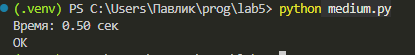

# Лабораторная работа №5: Замыкания и декораторы в Python


## Условие задачи

Создать **замыкание** для получения текста ответа на запрос к API `https://dogapi.dog/api/v2/facts`.

**Требования:**
- Замыкание должно отправлять GET-запрос к указанному API
- Возвращать текст полученного факта о собаках
- Применить **декоратор** для замера времени выполнения функции
- Обработать возможные ошибки запроса и парсинга ответа

---

## Описание проделанной работы

### 1. Структура программы

Программа состоит из трёх основных компонентов:

| Компонент | Назначение |
|-----------|------------|
| `timer_decorator` | Декоратор, измеряющий время выполнения функции |
| `api_requester(url)` | Внешняя функция замыкания, запоминающая URL |
| `get_fact()` | Внутренняя функция, отправляющая запрос и возвращающая факт |

### 2. Реализация декоратора

Декоратор `timer_decorator`:
- Принимает функцию `func` в качестве аргумента
- С помощью `@wraps(func)` сохраняет метаданные исходной функции
- Замеряет время выполнения с помощью `time.perf_counter()`
- Выводит результат в формате: `[ДЕКОРАТОР] Время выполнения: X.XXXX сек.`

### 3. Реализация замыкания

Функция `api_requester(url)`:
- Принимает URL API и сохраняет его в области видимости замыкания
- Внутри определяет функцию `get_fact()`, которая имеет доступ к `url`
- Возвращает функцию `get_fact`, не выполняя её сразу

**Механизм замыкания:**
- Переменная `url` продолжает существовать после завершения `api_requester`
- Внутренняя функция `get_fact` «запоминает» переданный URL

### 4. Обработка ошибок

Реализована двухуровневая обработка исключений:

```python
try:
    # отправка запроса и парсинг ответа
except requests.exceptions.RequestException as e:
    # сетевые ошибки, ошибки HTTP
    return f"Ошибка запроса: {e}"
except (KeyError, IndexError, ValueError) as e:
    # ошибки структуры JSON-ответа
    return f"Ошибка парсинга ответа: {e}"
```

# Отчет по выполнению лабораторной работы (уровень Medium)

## Задание

Разработать декоратор с опциональным параметром, поддерживающий рекурсивные функции, и применить его к замыканию.

## Условие задачи

1. Создать декоратор, который замеряет время выполнения функции.
2. Декоратор должен иметь опциональные параметры:
   - `active` - включает/отключает замер времени
   - `output` - включает/отключает вывод результата в консоль
3. Декоратор должен корректно работать с рекурсивными функциями (замерять только общее время внешнего вызова, а не каждого рекурсивного шага)
4. Применить декоратор к замыканию (функции, возвращающей случайный факт)
5. Применить декоратор к рекурсивной функции (вычисление чисел Фибоначчи)

## Описание проделанной работы

### 1. Реализация декоратора с опциональными параметрами

Был создан декоратор `timer_decorator`, который принимает два параметра:
- `active` (по умолчанию True) - определяет, нужно ли выполнять замер времени
- `output` (по умолчанию True) - определять, нужно ли выводить время в консоль

Ключевая особенность реализации - поддержка рекурсивных функций через механизм отслеживания глубины рекурсии с помощью переменной `recursion_depth`. Это позволяет замерить только время первого (внешнего) вызова, игнорируя внутренние рекурсивные вызовы.

### 2. Применение декоратора к замыканию

Создана функция `api_requester()`, которая возвращает замыкание `get_fact()`. К этому замыканию применен декоратор `timer_decorator`. Замыкание имитирует получение случайного факта о собаках с искусственной задержкой 0.3 секунды.

### 3. Применение декоратора к рекурсивной функции

Создана функция `make_fibonacci()`, которая возвращает рекурсивную функцию вычисления чисел Фибоначчи. Декоратор применен к этой функции. Благодаря механизму отслеживания глубины рекурсии, время выводится только один раз для всего вычисления, а не для каждого рекурсивного вызова.

### 4. Демонстрация работы декоратора с разными параметрами

В программе показаны три режима работы декоратора:
- Декоратор активен с выводом времени (режим по умолчанию)
- Декоратор отключен (параметр `active=False`)
- Декоратор работает, но вывод времени отключен (параметр `output=False`)

## Код программы

```python
import time
from functools import wraps

def timer_decorator(active=True, output=True):
    """
    Декоратор для замера времени выполнения функции.
    
    Параметры:
        active (bool): включает/отключает замер времени
        output (bool): включает/отключает вывод времени в консоль
    """
    def decorator(func):
        recursion_depth = 0
        
        @wraps(func)
        def wrapper(*args, **kwargs):
            nonlocal recursion_depth
            
            if not active:
                return func(*args, **kwargs)
            
            recursion_depth += 1
            
            if recursion_depth == 1:
                start = time.perf_counter()
                result = func(*args, **kwargs)
                end = time.perf_counter()
                
                if output:
                    print(f"[ДЕКОРАТОР] {func.__name__}: {end - start:.4f} сек.")
                
                wrapper.last_time = end - start
            else:
                result = func(*args, **kwargs)
            
            recursion_depth -= 1
            return result
        return wrapper
    return decorator

def api_requester():
    """Замыкание для получения случайного факта о собаках"""
    
    @timer_decorator(active=True, output=True)
    def get_fact():
        time.sleep(0.3)
        facts = [
            "Собаки могут понимать до 250 слов и жестов.",
            "Нос собаки так же уникален, как отпечаток пальца у человека.",
            "Собаки видят сны, как и люди.",
            "Собаки чувствуют магнитное поле Земли.",
            "Хвост собаки показывает её эмоции."
        ]
        import random
        return random.choice(facts)
    
    return get_fact

def make_fibonacci():
    """Фабрика для создания рекурсивной функции Фибоначчи"""
    
    @timer_decorator(active=True, output=True)
    def fibonacci(n):
        if n <= 1:
            return n
        return fibonacci(n-1) + fibonacci(n-2)
    
    return fibonacci

if __name__ == "__main__":
    print("="*60)
    print("ДЕМОНСТРАЦИЯ РАБОТЫ ДЕКОРАТОРА")
    print("="*60)
    
    print("\n1. ЗАМЫКАНИЕ С ДЕКОРАТОРОМ:")
    get_fact = api_requester()
    fact = get_fact()
    print(f"   Факт: {fact}")
    
    print("\n2. РЕКУРСИВНАЯ ФУНКЦИЯ (замеряется только внешний вызов):")
    fibonacci = make_fibonacci()
    result = fibonacci(30)
    print(f"   fib(30) = {result}")
    
    print("\n3. ДЕКОРАТОР ОТКЛЮЧЁН (active=False):")
    @timer_decorator(active=False)
    def disabled_func():
        return "   Декоратор выключен, время не замеряется"
    print(disabled_func())
    
    print("\n4. ДЕКОРАТОР БЕЗ ВЫВОДА (output=False):")
    @timer_decorator(active=True, output=False)
    def silent_func():
        time.sleep(0.1)
        return "   Декоратор работает, но вывод времени отключён"
    
    result = silent_func()
    print(result)
    print(f"   Время сохранено в атрибуте: {silent_func.last_time:.4f} сек.")
```
## Вывод программы
