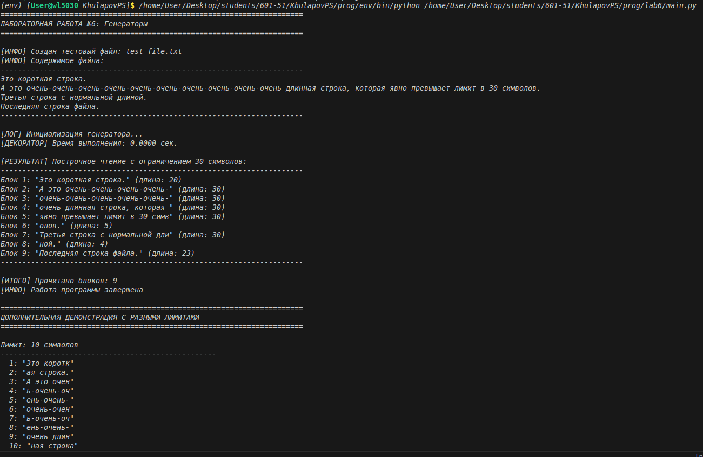
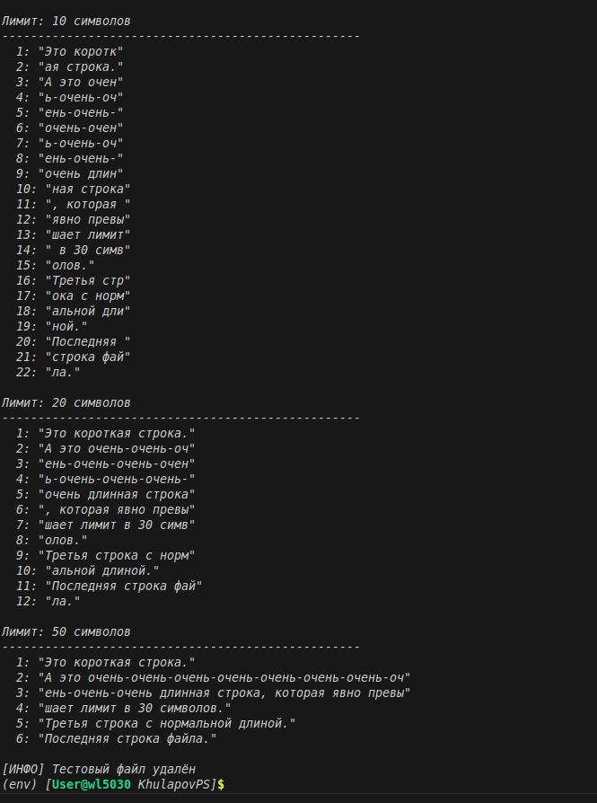

# Лабораторная работа №6: Генераторы

## Условие задачи

**Сложность:** Rare

**Задание:** Реализовать **генератор** для построчного чтения файла. Если длина строки превышает заданный предел — возвращает подстроку допустимого размера.

**Требования:**
- Генератор должен принимать путь к файлу и максимальную длину строки
- Построчно читать файл и возвращать строки (или их части) размером не более заданного предела
- Если строка длиннее предела — разбить её на несколько последовательных частей
- Использовать оператор `yield` для возврата значений
- Применить **декоратор** для логирования работы генератора
- Обработать возможные ошибки (файл не найден, нет прав доступа, проблемы с кодировкой)

---

## Описание проделанной работы

### 1. Что такое генератор

**Генератор** — это функция, которая использует оператор `yield` вместо `return`. При каждом вызове `next()` генератор продолжает выполнение с места последнего `yield`, автоматически сохраняя своё состояние.

**Преимущества генераторов:**
- Автоматическое сохранение состояния между вызовами
- Экономия памяти (значения генерируются на лету)
- Более чистый и читаемый код

### 2. Реализация декоратора `timer_decorator`

Декоратор использует `time.perf_counter()` для высокоточного измерения времени выполнения функции. Он оборачивает целевую функцию, замеряет время до и после вызова и выводит результат в консоль. Благодаря `functools.wraps` сохраняется метаинформация о декорируемой функции.

```python
def timer_decorator(func):
    @wraps(func)
    def wrapper(*args, **kwargs):
        start = time.perf_counter()
        result = func(*args, **kwargs)
        end = time.perf_counter()
        print(f"[ДЕКОРАТОР] Время выполнения: {end - start:.4f} сек.")
        return result
    return wrapper

### 3. Реализация замыкания `file_reader`

Функция `file_reader` реализует замыкание для построчного чтения файла с ограничением длины строки. Ниже представлен полный код с комментариями.

```python
def file_reader(filename, max_length, encoding='utf-8'):
    """
    Создаёт замыкание для чтения файла с ограничением длины строки. 
    Args:
        filename: путь к файлу
        max_length: максимальная длина строки (количество символов)
        encoding: кодировка файла (по умолчанию utf-8)
    
    Returns:
        функцию, которая при каждом вызове возвращает следующую часть текста
    """
    if max_length <= 0:
        raise ValueError("Максимальная длина строки должна быть положительным числом")

### 4. Вывод программы


