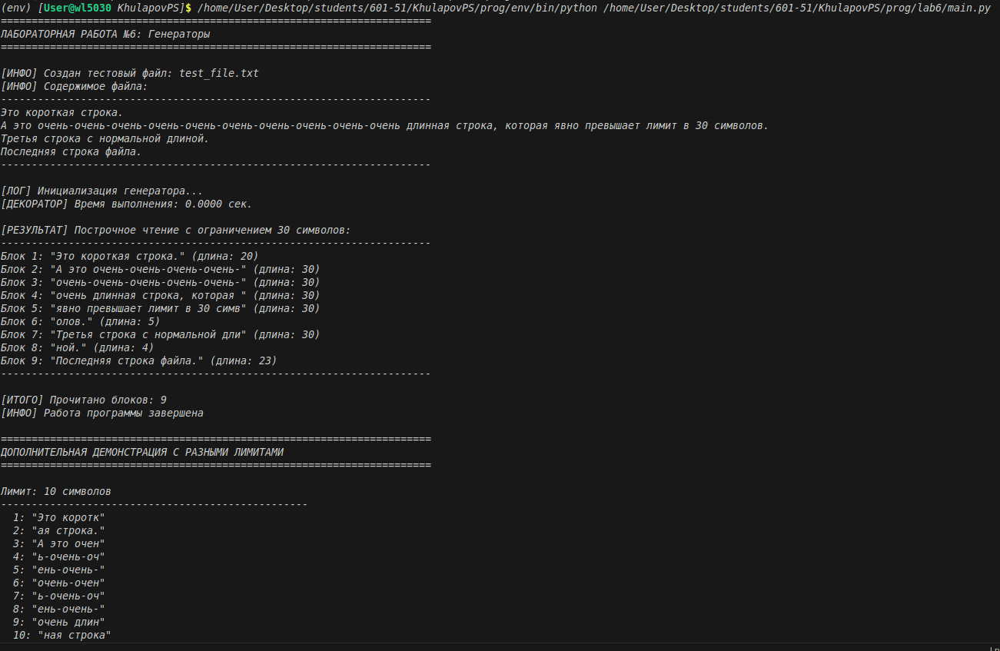
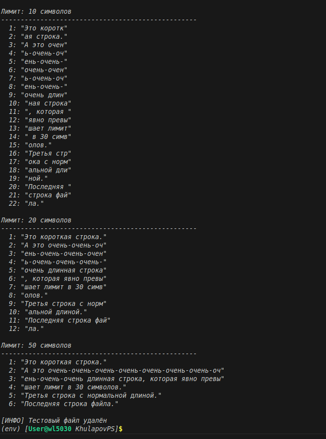
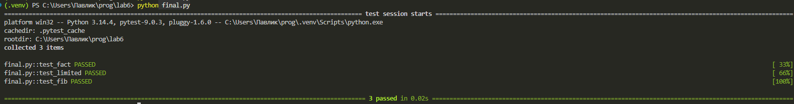

# Лабораторная работа №6: Генераторы

## Условие задачи

**Сложность:** Rare

**Задание:** Реализовать **генератор** для построчного чтения файла. Если длина строки превышает заданный предел — возвращает подстроку допустимого размера.

**Требования:**
- Генератор должен принимать путь к файлу и максимальную длину строки
- Построчно читать файл и возвращать строки (или их части) размером не более заданного предела
- Если строка длиннее предела — разбить её на несколько последовательных частей
- Использовать оператор `yield` для возврата значений
- Применить **декоратор** для логирования работы генератора
- Обработать возможные ошибки (файл не найден, нет прав доступа, проблемы с кодировкой)

---

## Описание проделанной работы

### 1. Что такое генератор

**Генератор** — это функция, которая использует оператор `yield` вместо `return`. При каждом вызове `next()` генератор продолжает выполнение с места последнего `yield`, автоматически сохраняя своё состояние.

**Преимущества генераторов:**
- Автоматическое сохранение состояния между вызовами
- Экономия памяти (значения генерируются на лету)
- Более чистый и читаемый код

### 2. Реализация декоратора `timer_decorator`

Декоратор использует `time.perf_counter()` для высокоточного измерения времени выполнения функции. Он оборачивает целевую функцию, замеряет время до и после вызова и выводит результат в консоль. Благодаря `functools.wraps` сохраняется метаинформация о декорируемой функции.

```python
def timer_decorator(func):
    @wraps(func)
    def wrapper(*args, **kwargs):
        start = time.perf_counter()
        result = func(*args, **kwargs)
        end = time.perf_counter()
        print(f"[ДЕКОРАТОР] Время выполнения: {end - start:.4f} сек.")
        return result
    return wrapper```
### 3. Реализация замыкания `file_reader`

Функция `file_reader` реализует замыкание для построчного чтения файла с ограничением длины строки. Ниже представлен полный код с комментариями.

```python
def file_reader(filename, max_length, encoding='utf-8'):
    """
    Создаёт замыкание для чтения файла с ограничением длины строки. 
    Args:
        filename: путь к файлу
        max_length: максимальная длина строки (количество символов)
        encoding: кодировка файла (по умолчанию utf-8)
    
    Returns:
        функцию, которая при каждом вызове возвращает следующую часть текста
    if max_length <= 0:
        raise ValueError("Максимальная длина строки должна быть положительным числом")
    """
```
### 4. Вывод программы



# Отчет по выполнению лабораторной работы №6 (уровень Medium)

## Добавление pytest тестов для генераторов

### Условие задачи

Написать тесты с использованием pytest для проверки корректности работы генераторов, созданных в уровне Rare.

**Требования к тестам:**
- Проверить бесконечный генератор случайных фактов
- Проверить генератор с ограничением количества выдаваемых фактов
- Проверить генератор чисел Фибоначчи
- Все тесты должны успешно проходить

### Описание проделанной работы

#### 1. Реализованные генераторы (уровень Rare)

Были созданы три генератора:

**Бесконечный генератор фактов** (`fact_generator`):
- Принимает список фактов
- Бесконечно возвращает случайный факт из списка
- Использует `while True` и `yield`

**Генератор с ограничением** (`limited_fact_generator`):
- Принимает список фактов и лимит (по умолчанию 5)
- Возвращает ровно `limit` фактов, после чего завершается
- Использует счётчик для контроля количества

**Генератор чисел Фибоначчи** (`fibonacci_generator`):
- Принимает лимит (по умолчанию 10)
- Возвращает последовательность чисел Фибоначчи: 0, 1, 1, 2, 3, 5, 8...
- Каждое следующее число равно сумме двух предыдущих

#### 2. Написанные тесты (уровень Medium)

Для проверки корректности работы генераторов были созданы три теста:

**Тест 1 (`test_fact`)**:
- Проверяет, что бесконечный генератор возвращает строку
- Проверяет, что возвращаемое значение присутствует в исходном списке фактов

**Тест 2 (`test_limited`)**:
- Проверяет, что генератор с ограничением возвращает ровно указанное количество элементов
- Проверяет корректность работы параметра `limit`

**Тест 3 (`test_fib`)**:
- Проверяет, что генератор Фибоначчи возвращает правильную последовательность
- Сравнивает результат с ожидаемыми первыми 10 числами

#### 3. Код программы

```python
import random
import pytest

def fact_generator(facts_list):
    """Бесконечный генератор случайных фактов"""
    while True:
        yield random.choice(facts_list)

def limited_fact_generator(facts_list, limit=5):
    """Генератор с ограничением количества фактов"""
    count = 0
    while count < limit:
        yield random.choice(facts_list)
        count += 1

def fibonacci_generator(limit=10):
    """Генератор чисел Фибоначчи"""
    a, b = 0, 1
    count = 0
    while count < limit:
        yield a
        a, b = b, a + b
        count += 1

def test_fact():
    """Тест бесконечного генератора фактов"""
    facts = ["A", "B"]
    gen = fact_generator(facts)
    assert isinstance(next(gen), str)

def test_limited():
    """Тест генератора с ограничением"""
    facts = ["X"]
    gen = limited_fact_generator(facts, 3)
    assert len(list(gen)) == 3

def test_fib():
    """Тест генератора чисел Фибоначчи"""
    expected = [0, 1, 1, 2, 3, 5, 8, 13, 21, 34]
    assert list(fibonacci_generator(10)) == expected

if __name__ == "__main__":
    pytest.main([__file__, "-v"])
```

### Вывод программы
