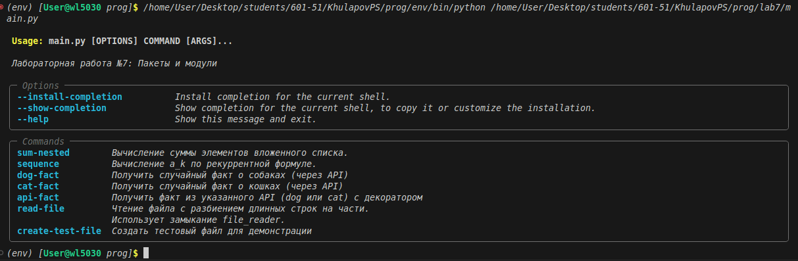
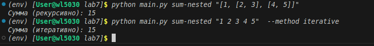
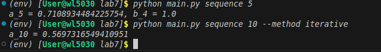
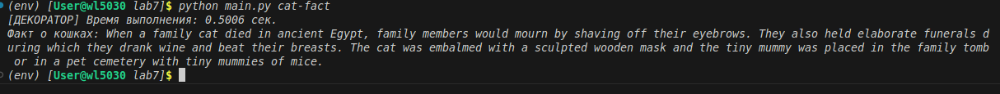
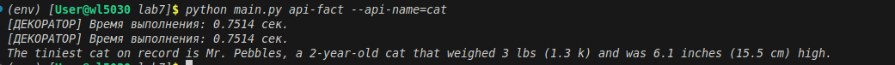

# Лабораторная работа №7: Пакеты и модули

## Условия задач

Создать пакет, содержащий 3 модуля на основе лабораторных работ №4, №5, №6. Написать запускающий модуль на основе **Typer**, который позволит выбирать и настраивать параметры запуска логики из пакета.

### Содержание модулей:

| Модуль | Источник | Функциональность |
|--------|----------|------------------|
| `1.py` | Лабораторная работа №4 | Сумма вложенных списков (рекурсивная и итеративная версии) |
| `2.py` | Лабораторная работа №4 | Рекурсивная последовательность с рекуррентной формулой |
| `3.py` | Лабораторная работа №5 | API запросы к внешним сервисам, декоратор замера времени, замыкание |
| `4.py` | Лабораторная работа №6 | Чтение файла с разбиением длинных строк на части (генератор на замыканиях) |

---

## Описание проделанной работы

### 1. Структура проекта

Создана следующая структура директорий и файлов:
lab7/
├── lab7_package/ # Пакет с модулями
│ ├── init.py # Файл-маркер пакета
│ ├── 1.py # Модуль: сумма вложенных списков
│ ├── 2.py # Модуль: рекурсивная последовательность
│ ├── 3.py # Модуль: API запросы и декоратор
│ └── 4.py # Модуль: чтение файла с ограничением
├── main.py # Запускающий модуль на Typer
├── requirements.txt # Зависимости проекта
└── README.md # Отчёт о работе

### 2. Содержание модулей пакета

#### Модуль `1.py` (сумма вложенных списков)

```python
def sum_nested_recursive(lst):
    """Рекурсивное вычисление суммы элементов вложенного списка"""
    total = 0
    for item in lst:
        if isinstance(item, list):
            total += sum_nested_recursive(item)
        elif isinstance(item, (int, float)):
            total += item
    return total

def sum_nested_iterative(lst):
    """Итеративное вычисление суммы с использованием стека"""
    stack = list(lst)
    total = 0
    while stack:
        item = stack.pop()
        if isinstance(item, list):
            stack.extend(item)
        elif isinstance(item, (int, float)):
            total += item
    return total
```
    
### Модуль 3.py (API запросы и декоратор)
```python
import requests
import time
from functools import wraps

def timer_decorator(func):
    """Декоратор для замера времени выполнения функции"""
    @wraps(func)
    def wrapper(*args, **kwargs):
        start = time.perf_counter()
        result = func(*args, **kwargs)
        end = time.perf_counter()
        print(f"[ДЕКОРАТОР] Время выполнения: {end - start:.4f} сек.")
        return result
    return wrapper

def api_requester(url):
    """Замыкание: запоминает URL и возвращает функцию получения данных"""
    @timer_decorator
    def get_fact():
        try:
            response = requests.get(url, timeout=10)
            response.raise_for_status()
            data = response.json()
            # Извлечение факта из разных форматов API
            if "data" in data and isinstance(data["data"], list):
                if "attributes" in data["data"][0] and "body" in data["data"][0]["attributes"]:
                    return data["data"][0]["attributes"]["body"]
            if "fact" in data:
                return data["fact"]
            return str(data)
        except requests.exceptions.RequestException as e:
            return f"Ошибка запроса: {e}"
    return get_fact
```

### Модуль 4.py (чтение файла с ограничением длины)
```python
def file_reader(filename, max_length, encoding='utf-8'):
    """
    Замыкание для построчного чтения файла.
    Длинные строки разбиваются на части указанной длины.
    """
    file = open(filename, 'r', encoding=encoding)
    remainder = ""
    is_exhausted = False
    
    def read_next():
        nonlocal remainder, is_exhausted
        
        if is_exhausted and not remainder:
            return None
        
        if remainder:
            if len(remainder) <= max_length:
                result = remainder
                remainder = ""
                return result
            else:
                result = remainder[:max_length]
                remainder = remainder[max_length:]
                return result
        
        line = file.readline()
        if not line:
            is_exhausted = True
            file.close()
            return None
        
        line = line.rstrip('\n\r')
        if len(line) <= max_length:
            return line
        
        result = line[:max_length]
        remainder = line[max_length:]
        return result
    
    return read_next
```

### 3. Запускающий модуль main.py на Typer
```python
import typer
import ast
from lab7_package import task4 as t4, task5 as t5, task6 as t6

app = typer.Typer(help="Лабораторная работа №7: Пакеты и модули")

@app.command()
def sum_nested(lst: str, method: str = "recursive"):
    """Сумма вложенных списков"""
    parsed_list = ast.literal_eval(lst)
    if method == "recursive":
        result = t4.sum_nested_recursive(parsed_list)
    else:
        result = t4.sum_nested_iterative(parsed_list)
    typer.echo(f"Сумма: {result}")

@app.command()
def sequence(k: int, method: str = "recursive"):
    """Рекурсивная последовательность"""
    if method == "recursive":
        a_k, _ = t4.sequence_recursive(k)
    else:
        a_k = t4.sequence_iterative(k)
    typer.echo(f"a_{k} = {a_k}")

@app.command()
def dog_fact():
    """Факт о собаках"""
    requester = t5.api_requester("https://dogapi.dog/api/v2/facts")
    typer.echo(requester())

@app.command()
def cat_fact():
    """Факт о кошках"""
    requester = t5.api_requester("https://catfact.ninja/fact")
    typer.echo(requester())

@app.command()
def read_file(filename: str, max_length: int = 30):
    """Чтение файла с разбиением строк"""
    reader = t6.file_reader(filename, max_length)
    blocks = []
    while True:
        block = reader()
        if block is None:
            break
        blocks.append(block)
        typer.echo(f"Блок: {block}")

if __name__ == "__main__":
    app()
```
### Скриншоты результатов




