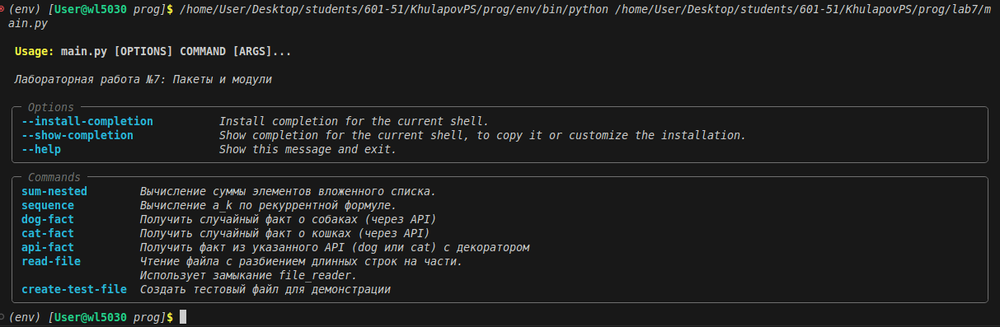
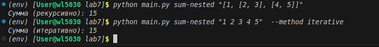
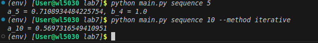
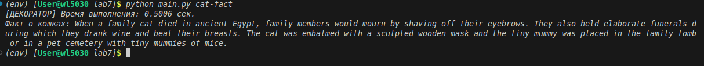
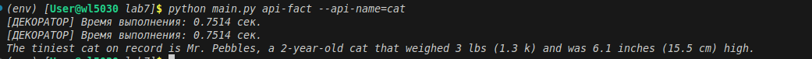
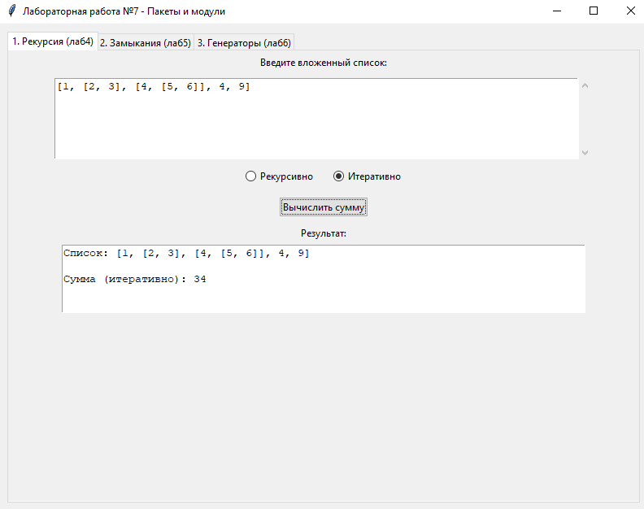

# Лабораторная работа №7: Пакеты и модули

## Условия задач

Создать пакет, содержащий 3 модуля на основе лабораторных работ №4, №5, №6. Написать запускающий модуль на основе **Typer**, который позволит выбирать и настраивать параметры запуска логики из пакета.

### Содержание модулей:

| Модуль | Источник | Функциональность |
|--------|----------|------------------|
| `1.py` | Лабораторная работа №4 | Сумма вложенных списков (рекурсивная и итеративная версии) |
| `2.py` | Лабораторная работа №4 | Рекурсивная последовательность с рекуррентной формулой |
| `3.py` | Лабораторная работа №5 | API запросы к внешним сервисам, декоратор замера времени, замыкание |
| `4.py` | Лабораторная работа №6 | Чтение файла с разбиением длинных строк на части (генератор на замыканиях) |

---

## Описание проделанной работы

### 1. Структура проекта

Создана следующая структура директорий и файлов:
lab7/
├── lab7_package/ # Пакет с модулями
│ ├── init.py # Файл-маркер пакета
│ ├── 1.py # Модуль: сумма вложенных списков
│ ├── 2.py # Модуль: рекурсивная последовательность
│ ├── 3.py # Модуль: API запросы и декоратор
│ └── 4.py # Модуль: чтение файла с ограничением
├── main.py # Запускающий модуль на Typer
├── requirements.txt # Зависимости проекта
└── README.md # Отчёт о работе

### 2. Содержание модулей пакета

#### Модуль `1.py` (сумма вложенных списков)

```python
def sum_nested_recursive(lst):
    """Рекурсивное вычисление суммы элементов вложенного списка"""
    total = 0
    for item in lst:
        if isinstance(item, list):
            total += sum_nested_recursive(item)
        elif isinstance(item, (int, float)):
            total += item
    return total

def sum_nested_iterative(lst):
    """Итеративное вычисление суммы с использованием стека"""
    stack = list(lst)
    total = 0
    while stack:
        item = stack.pop()
        if isinstance(item, list):
            stack.extend(item)
        elif isinstance(item, (int, float)):
            total += item
    return total
```
    
### Модуль 3.py (API запросы и декоратор)
```python
import requests
import time
from functools import wraps

def timer_decorator(func):
    """Декоратор для замера времени выполнения функции"""
    @wraps(func)
    def wrapper(*args, **kwargs):
        start = time.perf_counter()
        result = func(*args, **kwargs)
        end = time.perf_counter()
        print(f"[ДЕКОРАТОР] Время выполнения: {end - start:.4f} сек.")
        return result
    return wrapper

def api_requester(url):
    """Замыкание: запоминает URL и возвращает функцию получения данных"""
    @timer_decorator
    def get_fact():
        try:
            response = requests.get(url, timeout=10)
            response.raise_for_status()
            data = response.json()
            # Извлечение факта из разных форматов API
            if "data" in data and isinstance(data["data"], list):
                if "attributes" in data["data"][0] and "body" in data["data"][0]["attributes"]:
                    return data["data"][0]["attributes"]["body"]
            if "fact" in data:
                return data["fact"]
            return str(data)
        except requests.exceptions.RequestException as e:
            return f"Ошибка запроса: {e}"
    return get_fact
```

### Модуль 4.py (чтение файла с ограничением длины)
```python
def file_reader(filename, max_length, encoding='utf-8'):
    """
    Замыкание для построчного чтения файла.
    Длинные строки разбиваются на части указанной длины.
    """
    file = open(filename, 'r', encoding=encoding)
    remainder = ""
    is_exhausted = False
    
    def read_next():
        nonlocal remainder, is_exhausted
        
        if is_exhausted and not remainder:
            return None
        
        if remainder:
            if len(remainder) <= max_length:
                result = remainder
                remainder = ""
                return result
            else:
                result = remainder[:max_length]
                remainder = remainder[max_length:]
                return result
        
        line = file.readline()
        if not line:
            is_exhausted = True
            file.close()
            return None
        
        line = line.rstrip('\n\r')
        if len(line) <= max_length:
            return line
        
        result = line[:max_length]
        remainder = line[max_length:]
        return result
    
    return read_next
```

### 3. Запускающий модуль main.py на Typer
```python
import typer
import ast
from lab7_package import task4 as t4, task5 as t5, task6 as t6

app = typer.Typer(help="Лабораторная работа №7: Пакеты и модули")

@app.command()
def sum_nested(lst: str, method: str = "recursive"):
    """Сумма вложенных списков"""
    parsed_list = ast.literal_eval(lst)
    if method == "recursive":
        result = t4.sum_nested_recursive(parsed_list)
    else:
        result = t4.sum_nested_iterative(parsed_list)
    typer.echo(f"Сумма: {result}")

@app.command()
def sequence(k: int, method: str = "recursive"):
    """Рекурсивная последовательность"""
    if method == "recursive":
        a_k, _ = t4.sequence_recursive(k)
    else:
        a_k = t4.sequence_iterative(k)
    typer.echo(f"a_{k} = {a_k}")

@app.command()
def dog_fact():
    """Факт о собаках"""
    requester = t5.api_requester("https://dogapi.dog/api/v2/facts")
    typer.echo(requester())

@app.command()
def cat_fact():
    """Факт о кошках"""
    requester = t5.api_requester("https://catfact.ninja/fact")
    typer.echo(requester())

@app.command()
def read_file(filename: str, max_length: int = 30):
    """Чтение файла с разбиением строк"""
    reader = t6.file_reader(filename, max_length)
    blocks = []
    while True:
        block = reader()
        if block is None:
            break
        blocks.append(block)
        typer.echo(f"Блок: {block}")

if __name__ == "__main__":
    app()
```
### Скриншоты результатов







# Отчет по выполнению лабораторной работы №7 (уровень Medium)

## GUI приложение на Tkinter

### Условие задачи

Реализовать графическое пользовательское приложение (GUI) на актуальном фреймворке, которое объединяет функциональность трёх предыдущих лабораторных работ (№4, №5, №6) из разработанного пакета.

**Требования:**
- Приложение должно иметь удобный интерфейс для работы с каждой лабораторной работой
- Позволять выбирать параметры выполнения (метод рекурсии/итерации)
- Отображать результаты в наглядном виде
- Обрабатывать ошибки ввода пользователя

### Описание проделанной работы

#### 1. Выбор фреймворка

Для реализации GUI приложения был выбран **Tkinter** - стандартный фреймворк Python, который:
- Входит в стандартную библиотеку Python (не требует установки)
- Кроссплатформенный (работает на Windows, Linux, macOS)
- Имеет простой и понятный API
- Достаточно функционален для данного типа задач

#### 2. Структура приложения

Приложение организовано в виде трёх вкладок (Notebook), каждая из которых соответствует одной лабораторной работе:

| Вкладка | Лабораторная работа | Функциональность |
|---------|--------------------|------------------|
| Рекурсия (лаб4) | №4 | Вычисление суммы вложенного списка рекурсивным и итеративным методами |
| Замыкания (лаб5) | №5 | Демонстрация работы замыкания make_adder |
| Генераторы (лаб6) | №6 | Генерация чисел Фибоначчи и случайных фактов |

#### 3. Реализация функций

Все функции из лабораторных работ были интегрированы в GUI приложение:

**Лабораторная работа №4 - Рекурсия:**
- `sum_nested_recursive()` - рекурсивное вычисление суммы
- `sum_nested_iterative()` - итеративное вычисление суммы
- Пользователь может ввести любой вложенный список
- Возможность выбора метода вычисления через радиокнопки

**Лабораторная работа №5 - Замыкания:**
- `make_adder()` - замыкание, возвращающее функцию прибавления числа
- Пользователь вводит значения x и y
- Результат выводится в формате: make_adder(x)(y) = x + y = результат

**Лабораторная работа №6 - Генераторы:**
- `fibonacci_generator()` - генератор чисел Фибоначчи
- `fact_generator()` - генератор случайных фактов
- Пользователь может задать количество чисел Фибоначчи
- Пользователь может редактировать список доступных фактов

#### 4. Особенности интерфейса

- **Многоколоночная вкладка** - удобная навигация между функциональными блоками
- **Поля ввода с примерами** - облегчают понимание формата данных
- **Многострочные текстовые поля** - для ввода списков и фактов
- **Радиокнопки** - для выбора метода вычисления
- **Области вывода** - отображение результатов в удобном формате
- **Обработка ошибок** - всплывающие окна с сообщениями об ошибках

### Код программы

```python
import tkinter as tk
from tkinter import ttk, scrolledtext, messagebox
import random

# ========== ФУНКЦИИ ИЗ ЛАБОРАТОРНЫХ РАБОТ ==========

def sum_nested_recursive(lst):
    total = 0
    for item in lst:
        if isinstance(item, list):
            total += sum_nested_recursive(item)
        else:
            total += item
    return total

def sum_nested_iterative(lst):
    stack = list(lst)
    total = 0
    while stack:
        item = stack.pop()
        if isinstance(item, list):
            stack.extend(item)
        else:
            total += item
    return total

def make_adder(x):
    def adder(y):
        return x + y
    return adder

def fibonacci_generator(limit=10):
    a, b = 0, 1
    for _ in range(limit):
        yield a
        a, b = b, a + b

def fact_generator(facts_list):
    while True:
        yield random.choice(facts_list)

# ========== GUI ПРИЛОЖЕНИЕ ==========

class App:
    def __init__(self, root):
        self.root = root
        self.root.title("Лабораторная работа №7 - Пакеты и модули")
        self.root.geometry("800x600")

        notebook = ttk.Notebook(root)
        notebook.pack(fill=tk.BOTH, expand=True, padx=10, pady=10)

        self.create_recursion_tab(notebook)
        self.create_closure_tab(notebook)
        self.create_generators_tab(notebook)

    def create_recursion_tab(self, notebook):
        tab = ttk.Frame(notebook)
        notebook.add(tab, text="1. Рекурсия (лаб4)")

        ttk.Label(tab, text="Введите вложенный список:").pack(pady=5)
        self.input_text = scrolledtext.ScrolledText(tab, height=6, width=80)
        self.input_text.insert(tk.END, "[1, [2, 3], [4, [5, 6]], 7, 8]")
        self.input_text.pack(pady=5)

        self.method = tk.StringVar(value="recursive")
        frame = ttk.Frame(tab)
        frame.pack(pady=5)
        ttk.Radiobutton(frame, text="Рекурсивно", variable=self.method, value="recursive").pack(side=tk.LEFT, padx=10)
        ttk.Radiobutton(frame, text="Итеративно", variable=self.method, value="iterative").pack(side=tk.LEFT, padx=10)

        ttk.Button(tab, text="Вычислить сумму", command=self.calc_sum).pack(pady=10)

        ttk.Label(tab, text="Результат:").pack()
        self.output = tk.Text(tab, height=5, width=80, state=tk.DISABLED)
        self.output.pack(pady=5)

    def create_closure_tab(self, notebook):
        tab = ttk.Frame(notebook)
        notebook.add(tab, text="2. Замыкания (лаб5)")

        frame = ttk.Frame(tab)
        frame.pack(pady=30)

        ttk.Label(frame, text="x = ").grid(row=0, column=0, padx=5, pady=10)
        self.x_entry = tk.Entry(frame, width=15)
        self.x_entry.insert(0, "10")
        self.x_entry.grid(row=0, column=1, padx=5)

        ttk.Label(frame, text="y = ").grid(row=1, column=0, padx=5, pady=10)
        self.y_entry = tk.Entry(frame, width=15)
        self.y_entry.insert(0, "5")
        self.y_entry.grid(row=1, column=1, padx=5)

        ttk.Button(frame, text="Вычислить x + y", command=self.calc_closure).grid(row=2, column=0, columnspan=2, pady=20)

        self.closure_out = tk.Text(tab, height=3, width=50, state=tk.DISABLED)
        self.closure_out.pack(pady=20)

    def create_generators_tab(self, notebook):
        tab = ttk.Frame(notebook)
        notebook.add(tab, text="3. Генераторы (лаб6)")

        fib_frame = ttk.LabelFrame(tab, text="Генератор Фибоначчи")
        fib_frame.pack(fill=tk.X, padx=10, pady=10)

        ttk.Label(fib_frame, text="Количество чисел:").pack(side=tk.LEFT, padx=5)
        self.fib_limit = tk.Entry(fib_frame, width=10)
        self.fib_limit.insert(0, "15")
        self.fib_limit.pack(side=tk.LEFT, padx=5)

        ttk.Button(fib_frame, text="Сгенерировать", command=self.gen_fib).pack(side=tk.LEFT, padx=10)

        self.fib_out = tk.Text(fib_frame, height=5, width=70, state=tk.DISABLED)
        self.fib_out.pack(pady=10, padx=10)

        facts_frame = ttk.LabelFrame(tab, text="Генератор случайных фактов")
        facts_frame.pack(fill=tk.X, padx=10, pady=10)

        ttk.Label(facts_frame, text="Список фактов (каждый с новой строки):").pack()
        self.facts_input = scrolledtext.ScrolledText(facts_frame, height=4, width=70)
        default = "Собаки видят сны\nНос собаки уникален\nСобаки понимают до 250 слов\nСобаки чувствуют магнитное поле"
        self.facts_input.insert(tk.END, default)
        self.facts_input.pack(pady=5)

        ttk.Button(facts_frame, text="Получить случайный факт", command=self.gen_fact).pack(pady=5)

        self.fact_out = tk.Text(facts_frame, height=3, width=70, state=tk.DISABLED)
        self.fact_out.pack(pady=10)

    def calc_sum(self):
        try:
            text = self.input_text.get("1.0", tk.END).strip()
            lst = eval(text)

            if self.method.get() == "recursive":
                result = sum_nested_recursive(lst)
                method = "рекурсивно"
            else:
                result = sum_nested_iterative(lst)
                method = "итеративно"

            self.output.config(state=tk.NORMAL)
            self.output.delete("1.0", tk.END)
            self.output.insert(tk.END, f"Список: {lst}\n\nСумма ({method}): {result}")
            self.output.config(state=tk.DISABLED)

        except Exception as e:
            messagebox.showerror("Ошибка", f"Неверный формат списка: {e}")

    def calc_closure(self):
        try:
            x = int(self.x_entry.get())
            y = int(self.y_entry.get())
            adder = make_adder(x)
            result = adder(y)

            self.closure_out.config(state=tk.NORMAL)
            self.closure_out.delete("1.0", tk.END)
            self.closure_out.insert(tk.END, f"make_adder({x})({y}) = {x} + {y} = {result}")
            self.closure_out.config(state=tk.DISABLED)

        except ValueError:
            messagebox.showerror("Ошибка", "Введите целые числа")

    def gen_fib(self):
        try:
            limit = int(self.fib_limit.get())
            fib_list = list(fibonacci_generator(limit))

            self.fib_out.config(state=tk.NORMAL)
            self.fib_out.delete("1.0", tk.END)
            self.fib_out.insert(tk.END, ", ".join(map(str, fib_list)))
            self.fib_out.config(state=tk.DISABLED)

        except ValueError:
            messagebox.showerror("Ошибка", "Введите целое число")

    def gen_fact(self):
        try:
            text = self.facts_input.get("1.0", tk.END).strip()
            facts = [f.strip() for f in text.split('\n') if f.strip()]
            if not facts:
                messagebox.showerror("Ошибка", "Введите хотя бы один факт")
                return
            gen = fact_generator(facts)
            fact = next(gen)

            self.fact_out.config(state=tk.NORMAL)
            self.fact_out.delete("1.0", tk.END)
            self.fact_out.insert(tk.END, fact)
            self.fact_out.config(state=tk.DISABLED)

        except Exception as e:
            messagebox.showerror("Ошибка", str(e))


if __name__ == "__main__":
    root = tk.Tk()
    app = App(root)
    root.mainloop()
```
### Скриншоты результатов

