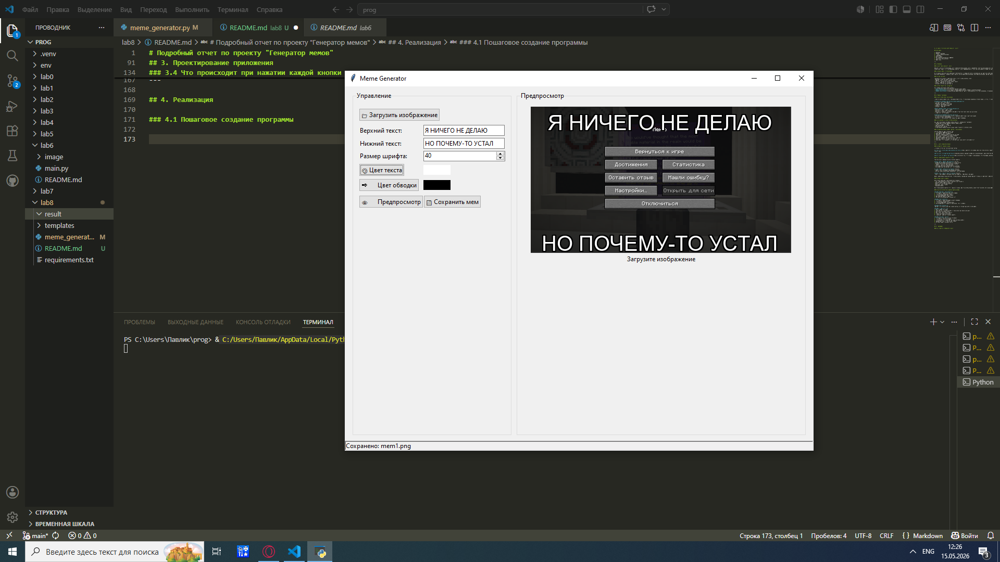

# Подробный отчет по проекту "Генератор мемов"

## Содержание

1. Введение
2. Анализ требований
3. Проектирование приложения
4. Реализация
5. Тестирование
6. Инструкция по установке и запуску
7. Руководство пользователя
8. Заключение

---

## 1. Введение

### 1.1 Что такое генератор мемов

Генератор мемов — это приложение, которое позволяет пользователю быстро накладывать текст на изображение для создания юмористических картинок, называемых мемами. В отличие от сложных графических редакторов вроде Photoshop, генератор мемов специализируется только на одной задаче и делает её максимально просто и быстро.

### 1.2 Зачем нужно это приложение

В современном интернете мемы используются повсеместно: в социальных сетях, мессенджерах, на работе для внутренних коммуникаций, в рекламе. Существующие онлайн-генераторы требуют подключения к интернету, показывают рекламу и могут собирать личные данные пользователей. Десктопное приложение работает без интернета, не показывает рекламу и всегда доступно.

### 1.3 Цель проекта

Разработать программу с графическим окном, в которой пользователь может:
- Загрузить любую картинку с компьютера
- Написать текст сверху и снизу картинки
- Настроить внешний вид текста (размер, цвет)
- Увидеть результат до сохранения
- Сохранить готовый мем на компьютер

### 1.4 Инструменты для разработки

Для создания приложения использовались:
- **Язык Python** — простой и понятный язык программирования
- **Библиотека Tkinter** — встроенная в Python библиотека для создания оконных приложений
- **Библиотека Pillow** — дополнительная библиотека для работы с изображениями (открытие, изменение, сохранение)

---

## 2. Анализ требований

### 2.1 Что должно уметь приложение

Прежде чем начать писать код, я определил список того, что приложение обязательно должно делать, и того, что было бы хорошо добавить.

**Обязательные функции (без них приложение бесполезно):**
- Открывать окно с интерфейсом
- Загружать картинки с компьютера
- Показывать загруженную картинку
- Добавлять текст на картинку
- Сохранять результат

**Важные функции (делают приложение удобным):**
- Возможность менять размер шрифта
- Возможность менять цвет текста
- Возможность добавлять обводку вокруг букв (чтобы текст было видно на любом фоне)
- Предпросмотр до сохранения

**Дополнительные функции (приятные мелочи):**
- Автоматическое преобразование текста в заглавные буквы (как в настоящих мемах)
- Строка состояния с подсказками
- Возможность выбора цвета через стандартную палитру Windows

### 2.2 Требования к компьютеру пользователя

Для работы приложения не нужен мощный компьютер. Минимальные требования:
- Операционная система: Windows 7/10/11, macOS, Linux
- Процессор: любой от 1 ГГц
- Оперативная память: от 128 МБ
- Свободное место: 50 МБ
- Установленный Python (если программа распространяется в исходном коде)

### 2.3 Как пользователь будет работать с приложением

Обычный сценарий работы выглядит так:
1. Пользователь запускает программу
2. Видит пустое окно с кнопками
3. Нажимает кнопку загрузки и выбирает картинку
4. Пишет текст в два поля (верхний и нижний)
5. Настраивает размер шрифта и цвета
6. Нажимает кнопку предпросмотра и видит результат
7. Если всё нравится, сохраняет мем на диск
8. Если нужно что-то изменить, корректирует настройки и повторяет предпросмотр

---

## 3. Проектирование приложения

### 3.1 Как устроена программа

Программа состоит из трёх логических частей:

**Первая часть — интерфейс (пользовательское окно).** Здесь находятся все кнопки, поля для ввода текста и область, где показывается картинка. Пользователь видит только эту часть и работает только с ней.

**Вторая часть — обработка действий.** Когда пользователь нажимает кнопку, программа понимает, какое действие нужно выполнить, и запускает соответствующий код.

**Третья часть — работа с картинкой.** Здесь происходит всё, что связано с изображением: открытие файла, наложение текста, изменение размера для предпросмотра, сохранение.

### 3.2 Расположение элементов в окне

Окно программы разделено на две основные области:

**Левая область (панель управления)** содержит:
- Кнопку для загрузки изображения (в верхней части)
- Два поля для ввода текста (верхний и нижний)
- Регулятор размера шрифта (цифрами)
- Две кнопки для выбора цвета (текста и обводки)
- Две кнопки действий (предпросмотр и сохранение)

**Правая область (поле для картинки)** содержит:
- Область, где отображается загруженная картинка
- Если картинка не загружена, показывается текст-подсказка

**Нижняя часть окна (строка состояния)** содержит:
- Текст с информацией о последнем действии (например, "Загружено: cat.jpg")

Такое расположение выбрано потому, что пользователь сначала настраивает параметры слева, а сразу видит результат справа. Это естественно и не требует дополнительных объяснений.

### 3.3 Как хранятся данные

В программе используются переменные для хранения:
- Путь к загруженной картинке (чтобы потом её сохранить)
- Сама картинка в памяти компьютера
- Текст, который ввёл пользователь
- Выбранный размер шрифта
- Выбранные цвета

Все эти переменные обновляются в реальном времени. Как только пользователь меняет текст или цвет, программа запоминает новое значение.

### 3.4 Что происходит при нажатии каждой кнопки

**Кнопка "Загрузить изображение":**
1. Открывается стандартное окно выбора файла
2. Пользователь выбирает картинку
3. Программа запоминает путь к файлу
4. Картинка загружается в память
5. Автоматически показывается предпросмотр

**Кнопка "Цвет текста":**
1. Открывается стандартная палитра цветов Windows
2. Пользователь выбирает цвет
3. Программа запоминает выбранный цвет
4. Цвет показывается в маленьком квадратике рядом с кнопкой

**Кнопка "Цвет обводки":**
Работает точно так же, как выбор цвета текста, но отвечает за контур вокруг букв.

**Кнопка "Предпросмотр":**
1. Берёт текущую картинку
2. Уменьшает её, чтобы поместилась в окне (если она слишком большая)
3. Берёт текст из полей ввода
4. Берёт настройки шрифта и цветов
5. Рисует текст поверх картинки
6. Показывает результат в правой области

**Кнопка "Сохранить мем":**
1. Открывается окно выбора места сохранения
2. Пользователь вводит имя файла
3. Программа берёт оригинальную картинку (не уменьшенную)
4. Накладывает текст с теми же настройками
5. Сохраняет файл в выбранном месте

## 4. Реализация

